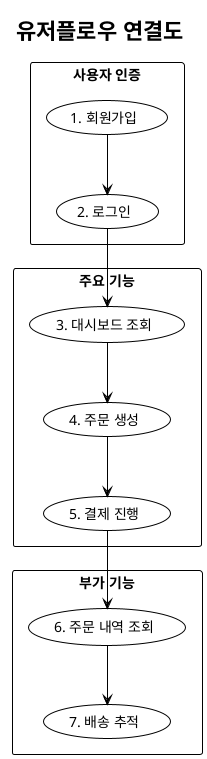
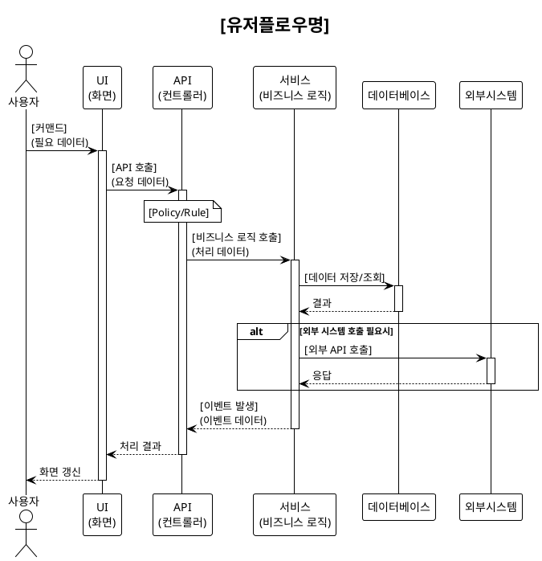
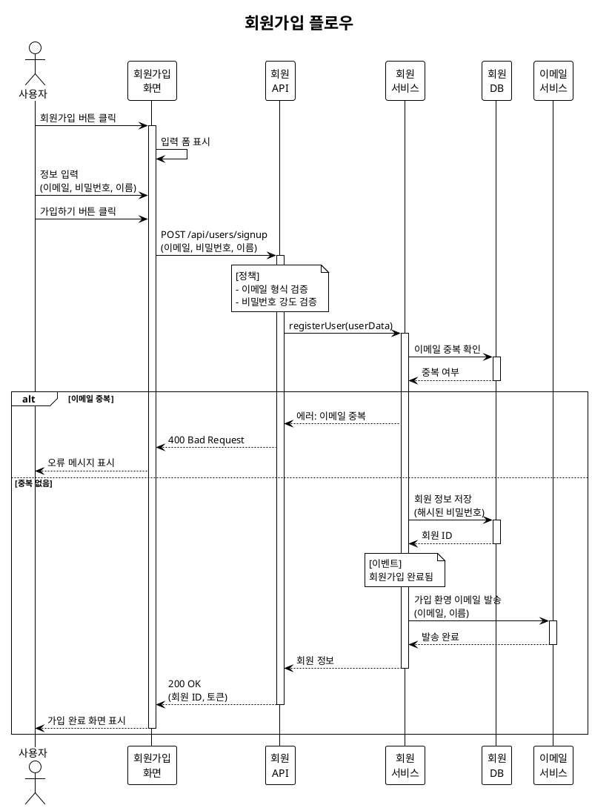
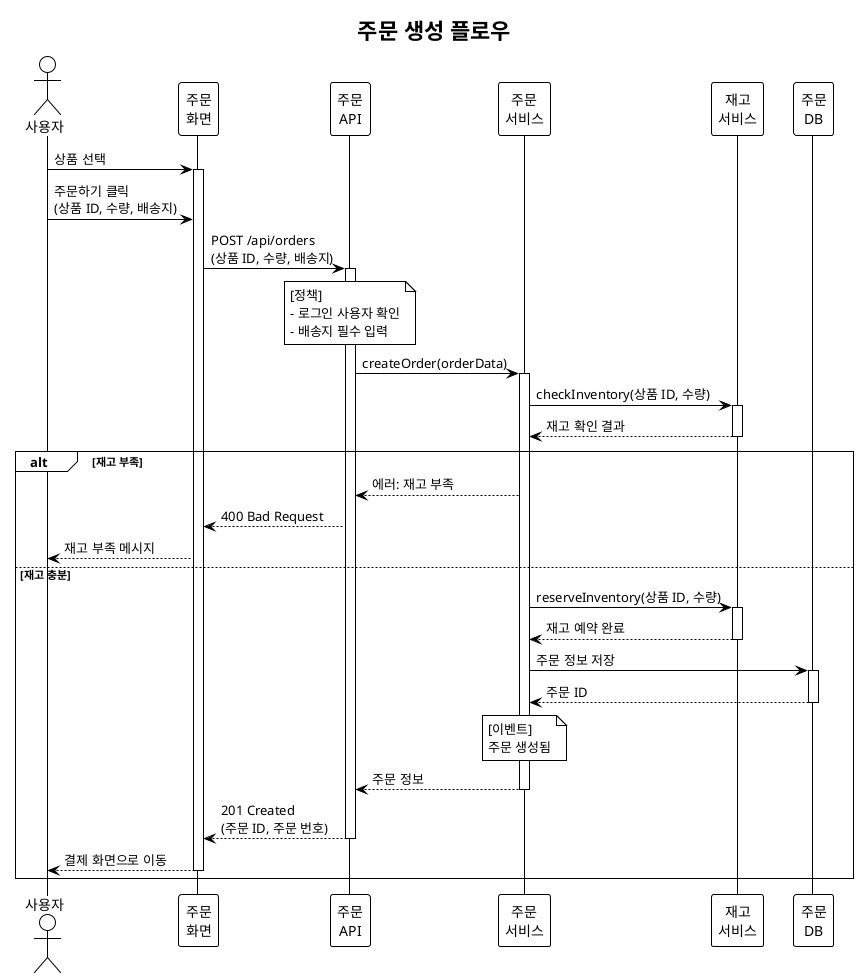

# Event Storming - 기획 구체화

## 목적

DDD(Domain-Driven Design)의 Event Storming 기법을 활용하여 선택된 솔루션의 시스템 이벤트 흐름을 분석하고, PlantUML 시퀀스 다이어그램으로 표현하여 유저스토리 작성을 준비합니다.

## 사용 시점

- 핵심 솔루션이 선정된 후
- 유저스토리 작성 전 시스템 설계가 필요할 때
- 비즈니스 플로우를 시각화해야 할 때
- 사용자가 "이벤트 스토밍", "시퀀스 다이어그램", "유저플로우"를 언급할 때

## 필수 입력

- 핵심 솔루션: `think/핵심솔루션.md` (solution-selection 결과)
- 대상 고객 정의: `define/고객분석.md` (customer-analysis 결과)
- User Journey Map (선택): `define/유저저니맵.md` (journey-mapping 결과)
- 비즈니스 모델 (선택): `think/비즈니스모델.md` (business-modeling 결과)

## Event Storming 프로세스

### 개념 이해

Event Storming은 Alberto Brandolini가 고안한 워크숍 기법으로, 비즈니스 도메인을 빠르게 탐색하고 시각화하는 방법입니다.

**단계**:
1. Big Picture: 전체 흐름 파악
2. Process Modeling: 프로세스 상세화
3. Software Design: 소프트웨어 설계

### 우리의 접근 방법

이 skill에서는 Event Storming의 핵심 요소만 추출하여:
- 이벤트 (Events)
- 커맨드 (Commands)
- 액터 (Actors)
- 정책/규칙 (Policies/Rules)
- 외부 시스템 (External Systems)
- 필요 데이터 (Data)

를 도출하고, 이를 **PlantUML 시퀀스 다이어그램**으로 작성합니다.

## PlantUML 시퀀스 다이어그램 작성

### 1. 유저플로우 식별

먼저 핵심 솔루션의 주요 사용자 플로우를 식별합니다.

**예시**:
- 사용자 등록 플로우
- 로그인 플로우
- 주문 생성 플로우
- 결제 플로우
- 배송 조회 플로우

### 2. 유저플로우 간 연결도 작성

**파일명**: `think/es/userflow.puml`

**내용**:


### 3. 각 유저플로우별 시퀀스 다이어그램 작성

각 유저플로우마다 별도의 PlantUML 파일로 작성합니다.

**파일명 형식**: `think/es/{순번}-{유저플로우명}.puml`
**예시**: `think/es/01-회원가입.puml`, `think/es/02-로그인.puml`

#### PlantUML 시퀀스 다이어그램 템플릿



### 4. Event Storming 핵심 요소 도출

#### 이벤트 (Events)
시스템에서 발생하는 중요한 사건 (과거형)

**표기**: `[이벤트명] 발생`
**예시**:
- 회원가입 완료됨
- 로그인 성공됨
- 주문 생성됨
- 결제 완료됨
- 배송 시작됨

#### 커맨드 (Commands)
사용자나 시스템이 수행하는 행위 (명령형)

**표기**: `[커맨드명]`
**예시**:
- 회원가입 요청
- 로그인 시도
- 주문 생성
- 결제 진행
- 배송 조회

#### 액터 (Actors)
시스템과 상호작용하는 주체

**예시**:
- 사용자
- 관리자
- 배송 기사
- 시스템 스케줄러

#### 정책/규칙 (Policies/Rules)
이벤트 발생 시 자동으로 실행되는 규칙

**표기**: `note over [참여자] : [정책/규칙]`
**예시**:
- "이메일 중복 확인"
- "재고 확인 필수"
- "결제 금액 검증"
- "배송지 유효성 검사"

#### 외부 시스템 (External Systems)
시스템이 연동하는 외부 서비스

**예시**:
- 결제 게이트웨이 (PG사)
- 이메일 발송 서비스
- SMS 서비스
- 물류 시스템
- 지도 API

#### 필요 데이터 (Data)
각 단계에서 필요한 데이터를 명시

**표기**: 화살표 라벨에 `(데이터)`로 표시
**예시**:
- (이메일, 비밀번호, 이름)
- (주문 ID, 상품 목록, 배송지)
- (결제 금액, 결제 수단)

## PlantUML 시퀀스 다이어그램 상세 예시

### 예시 1: 회원가입 플로우

**파일**: `think/es/01-회원가입.puml`



### 예시 2: 주문 생성 플로우

**파일**: `think/es/04-주문생성.puml`



## PlantUML 확인 방법

작성한 PlantUML 다이어그램은 다음 방법으로 확인할 수 있습니다:

### 방법 1: PlantUML Online Server
1. https://plantuml.com 접속
2. 좌측 메뉴에서 "Online Server" 클릭
3. PlantUML 스크립트 붙여넣기
4. 하단 우측 PNG 또는 SVG 링크에서 우클릭 > "새 탭에서 링크 열기"

### 방법 2: VS Code 플러그인
1. VS Code에서 "PlantUML" 확장 설치
2. .puml 파일 열기
3. `Alt + D` (미리보기 창 열기)

## 유저스토리 연결

Event Storming 결과는 다음 단계인 유저스토리 작성의 기반이 됩니다.

### 유저스토리 도출 방법

#### 1. 유저플로우 → Epic
각 주요 유저플로우가 하나의 Epic이 됩니다.

**예시**:
- Epic 1: 사용자 인증
  - Story 1.1: 회원가입
  - Story 1.2: 로그인
  - Story 1.3: 비밀번호 재설정

#### 2. 시퀀스 다이어그램 → User Story
각 시퀀스 다이어그램의 흐름이 하나의 User Story가 됩니다.

**예시**:
```
User Story 1.1: 회원가입

As a 신규 사용자,
I want 이메일로 회원가입하기,
So that 서비스를 이용할 수 있다.

Acceptance Criteria:
- Given 회원가입 화면에서
  When 유효한 이메일, 비밀번호, 이름을 입력하고 가입하기 버튼을 클릭하면
  Then 회원 정보가 저장되고 환영 이메일이 발송된다

- Given 회원가입 화면에서
  When 이미 등록된 이메일로 가입을 시도하면
  Then "이미 등록된 이메일입니다" 오류 메시지가 표시된다
```

#### 3. Policy/Rule → Acceptance Criteria
시퀀스 다이어그램의 정책/규칙이 Acceptance Criteria가 됩니다.

#### 4. 이벤트 → 시스템 동작 검증
각 이벤트는 시스템 동작의 검증 포인트가 됩니다.

## 도구 활용

### Sequential MCP 사용
복잡한 시스템 분석과 체계적인 이벤트 도출을 위해 Sequential MCP를 활용하세요.

### 작성 순서
1. 핵심 솔루션 분석
2. 주요 유저플로우 식별 (5-10개)
3. 유저플로우 간 연결도 작성
4. 각 유저플로우별 시퀀스 다이어그램 작성
5. 이벤트, 커맨드, 액터, 정책, 외부시스템 도출
6. 유저스토리 준비 정보 정리

## 출력 파일

### 필수 파일
- **유저플로우 연결도**: `think/es/userflow.puml`
- **각 유저플로우 시퀀스**: `think/es/{순번}-{유저플로우명}.puml`
  - 예: `think/es/01-회원가입.puml`
  - 예: `think/es/02-로그인.puml`
  - 예: `think/es/03-대시보드조회.puml`

### 파일명 규칙
- **순번**: 2자리 숫자 (01, 02, 03...)
- **유저플로우명**: 한글로 작성
- **확장자**: .puml

## 중요 가이드라인

### PlantUML 작성 규칙
- **테마**: 항상 `!theme mono` 사용
- **한국어**: 모든 텍스트를 한국어로 작성
- **이벤트**: 과거형으로 표현 (예: "회원가입 완료됨", "주문 생성됨")
- **커맨드**: 명령형으로 표현 (예: "회원가입 요청", "주문 생성")
- **데이터**: 화살표 라벨에 괄호로 명시 (예: `(이메일, 비밀번호)`)
- **정책**: `note over` 사용하여 명시

### Sequential MCP 활용
- 복잡한 도메인 분석
- 이벤트와 커맨드 도출
- 유저플로우 간 의존성 분석
- 유저스토리 준비 정보 생성

### 유저스토리 에이전트 준비
- 최소 5개 이상의 핵심 유저플로우 작성
- 각 시퀀스 다이어그램은 구현 가능한 수준으로 상세하게
- 이벤트, 커맨드, 정책을 명확히 표시
- 외부 시스템 연동이 필요한 경우 명시

### 품질 기준
- 실제 시스템 아키텍처를 반영
- 유저스토리로 직접 변환 가능한 수준
- 개발팀이 이해하고 구현할 수 있는 명확성
- 비즈니스 로직과 기술적 세부사항의 균형

## 다음 단계

Event Storming이 완료되면:
1. `user-stories` skill을 사용하여 유저스토리 작성
2. 시퀀스 다이어그램을 참고하여 Acceptance Criteria 작성
3. Epic과 Story 우선순위 결정
4. Sprint Planning 수행
