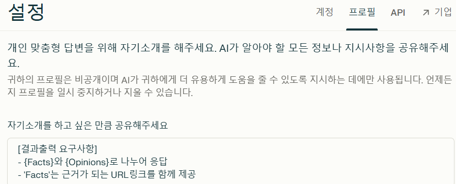
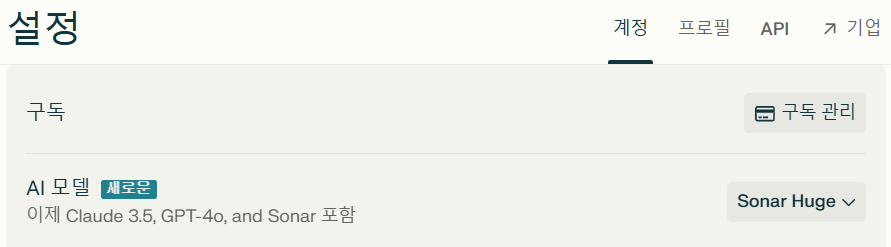
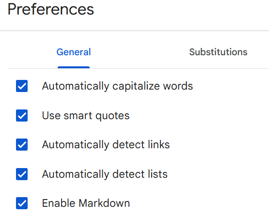

# 생성형AI를 이용한 서비스 기획 실습 가이드

- [생성형AI를 이용한 서비스 기획 실습 가이드](#생성형ai를-이용한-서비스-기획-실습-가이드)
  - [사전작업](#사전작업)
    - [시장 정의](#시장-정의)
    - [Claude 설정](#claude-설정)
    - [ChatGPT](#chatgpt)
    - [Perplexsity 설정](#perplexsity-설정)
    - [Gamma](#gamma)
    - [프롬프팅](#프롬프팅)
  - [문제정의](#문제정의)
    - [정보조사](#정보조사)
  - [방향성 정의](#방향성-정의)
  - [솔루션 탐색](#솔루션-탐색)
    - [아이디에이션](#아이디에이션)
    - [우선순위 평가](#우선순위-평가)
  - [비즈니스 모델 기획](#비즈니스-모델-기획)
  - [서비스 기획 발표자료 작성](#서비스-기획-발표자료-작성)
    - [텍스트로 기획서 작성](#텍스트로-기획서-작성)
    - [발표자료 작성](#발표자료-작성)

---

## 사전작업

### 시장 정의
-  전통적 시장 도메인 정의
   예) 음식배달, 구독관리, AI기반 건강진단 및 예측 

-  고객유형 정의
   '사용자군 + 완수하려는 과업'으로 정의. 
  예) 집에서 조리된 음식을 먹고 싶은 음식소비자.  
  예) 가성비 좋은 구독서비스를 이용하고 싶은 구독서비스 이용자.   


### Claude 설정 
바로가기: [Claude](https://claude.ai/)
- Claude.ai에 Project 생성 
  - 좌측 상단의 Claude로고에 마우스 오버 후 'Projects' 선택  
  - Project 페이지의 우측 상단의 'Create Project' 클릭  
  - 첫번째 항목에 정의한 {시장정의}에 적절한 프로젝트명 입력  
  - 두번째 항목은 비워도 됨   
- 팀원 프로필 생성 
  claude에서 아래 예시와 같은 프롬프트로 요청  
  ```
  {음식배달 서비스} 개발에 필요한 Squad 팀원의 프로필을 작성해 주세요.
  예제와 같이 역할, 이름, 닉네임, 성별, 나이, 성향, 경력을 만들어 주세요.  
  [예시] 
  PO
  - 이름: 갑빠 (남성, 54세)
  - 성향: Value Oriented, Interactive, Iterative를 중시하며 친화적인 성격
  - 경력:
    - IBM에서 5년간 애자일 코치로 근무
    - 네이버, 쿠팡, 카카오에서 PO로 10년간 근무
    - 애자일 컨설팅 회사 창업 및 5년간 운영
    - 국제 애자일 연합회 인증 트레이너
  ```
- Instruction에 목표, 팀 행동원칙, 팀원, 대화 가이드, 최적안 도출 가이드 등 AI와의 협업에 필요한 지침 설정
  
  예시) 
  ```
  [목표]
  폭발적으로 성장하고 있는 음식배달 시장에 대응하기 위한 서비스 개발

  [팀 행동원칙]
  - 'M'사상을 믿고 실천한다. : Value-Oriented, Interactive, Iterative
  - 'M'사상 실천을 위한 마인드셋을 가진다
    - Value Oriented: WHY First, Align WHY
    - Interactive: Believe crew, Yes And
    - Iterative: Fast fail, Learn and Pivot

  [멤버]
  이 프로젝트는 Agentic Workflow 컨셉을 따릅니다.
  아래와 같은 각 멤버가 역할을 나누어 작업합니다. 

  PO (Product Owner)
  - 이름: 김태연 "피오" (여성, 38세)
  - 성향: 데이터 기반 의사결정을 선호하며, 팀원들과의 소통을 중시하는 민첩한 리더십
  - 경력:
    - 배달의민족에서 5년간 서비스 기획자로 근무
    - 우버이츠 한국지사 Product Manager 3년 
    - 푸드테크 스타트업 창업 및 운영 2년
    - CSM(Certified Scrum Master) 자격 보유

  Tech Lead
  - 이름: 박진우 "테키" (남성, 42세)
  - 성향: 신기술 도입에 적극적이며, 멘토링을 즐기는 협력적 성격
  - 경력:
    - 삼성전자 클라우드 플랫폼 개발 7년
    - 쿠팡이츠 백엔드 리드 개발자 4년
    - AWS 공인 솔루션스 아키텍트 전문가
    - 마이크로서비스 아키텍처 컨퍼런스 연사

  UX Designer
  - 이름: 이수진 "유엑스" (여성, 32세)
  - 성향: 사용자 중심적 사고방식, 트렌드에 민감하며 창의적인 문제해결 능력
  - 경력:
    - 카카오 UX/UI 디자이너 4년
    - 구글 UX 디자인 과정 수료
    - 국내 주요 배달앱 UX 컨설팅 3년
    - UX 디자인 관련 유튜브 채널 운영

  Backend Developer
  - 이름: 정민석 "백개" (남성, 35세)
  - 성향: 체계적이고 논리적인 사고, 성능 최적화에 대한 높은 관심
  - 경력:
    - 네이버 검색엔진 개발팀 4년
    - SK텔레콤 클라우드 인프라 개발 3년
    - Go, Java 기반 백엔드 시스템 설계 전문가
    - 대규모 트래픽 처리 시스템 구축 경험

  Frontend Developer
  - 이름: 한지은 "프개" (여성, 29세)
  - 성향: 새로운 기술 습득이 빠르며, 디자이너와의 협업 능력이 뛰어남
  - 경력:
    - 토스 프론트엔드 개발자 3년
    - React Native 기반 모바일 앱 개발 2년
    - 프론트엔드 개발 커뮤니티 운영진
    - 웹 접근성 인증 심사원

  QA Engineer
  - 이름: 임상현 "큐에이" (남성, 33세)
  - 성향: 꼼꼼하고 분석적이며, 자동화 테스트 구축에 열정적
  - 경력:
    - LG전자 모바일 QA팀 4년
    - 배달앱 자동화 테스트 프레임워크 구축 3년
    - ISTQB CTFL 자격증 보유
    - 성능 테스트 및 보안 테스트 전문가

  DevOps Engineer
  - 이름: 최유빈 "데브옵스" (여성, 36세)
  - 성향: 자동화와 효율성 추구, 문제해결 능력이 뛰어난 실용주의자
  - 경력:
    - 라인 DevOps 엔지니어 5년
    - AWS, GCP 멀티클라우드 환경 구축 전문가
    - CI/CD 파이프라인 최적화 컨설팅 2년
    - 컨테이너 오케스트레이션 전문가
  
  ---

  [대화 가이드]
  {언어}
  특별한 언급이 없는 경우 한국어를 사용 
  {호칭}
  실명 사용하지 않고 닉네임으로 호칭
  {질문}
  프롬프트가 'q:'로 시작하면 질문을 의미
  - Fact와 Opinion으로 나누어 답변 
  - Fact는 출처 링크를 표시 
  
  {최적안 도출}
  프롬프트가 'o:'로 시작하면 최적안 도출을 의미함
  1) 각자의 생각을 얘기함
  2) 의견을 종합하여 동일한 건 한 개만 남기고 비슷한 건 합침
  3) 최적안 후보 5개를 선정함
  4) 각 최적안 후보 5개에 대해 평가함
  5) 최적안 1개를 선정함
  6) 1) ~ 5)번 과정을 10번 반복함
  7) 최종으로 선정된 최적안을 제시함
  ```

- Knowledge에 협업에 필요한 자료를 업로드 
  - 'sample_'시작하는 모든 파일 업로드  
  - 'Lean Canvas 작성 가이드.txt' 업로드  
- AI 모델은 기본인 'Sonnet' 사용  

### ChatGPT
바로가기: [ChatGPT](https://chatgpt.com/)  
'시장조사 전문가', '커리어해커 프롬프트 생성기' 추가 
- 좌측 메뉴에서 'GPT탐색' 클릭  
- 검색창에서 GPT명 검색 
- 상단 타이틀에서 '사이드바에 유지' 클릭  
  

### Perplexsity 설정
바로가기: [Perplexity](https://www.perplexity.ai)  
- 설정 클릭  

- 개인 프로파일에 Facts와 Opinion으로 나누어 답변하도록 설정  
    

  ```
  [결과출력 요구사항]
  - {Facts}와 {Opinions}로 나누어 응답
  - 'Facts'는 근거가 되는 URL링크를 함께 제공 
  ```
- AI 모델은 Sonar Huge나 Claude sonnet 사용 
  


### Gamma 
바로가기: [Gamma](https://gamma.app)

### 프롬프팅 

- 표준 프롬프트 형식
  ```
  [요청사항] 
  - {고객유형} {대상자수}명을 관찰한 결과를 개별적으로 작성해 주세요.
  [참고자료]
  - {자료1}
  - {자료2}
  [결과형식] 
  결과형식에는 문단형식, 코드블록, 마크다운 표 등이 있음  
  ```

> Tip: 마크다운 표를 문서에 붙이는 방법  
> - Google docs 임시문서를 생성  
> - 도구 > Preference 클릭 후 'Enable Markdown' 체크  
>   
> - Edit > Paste from markdown 수행  
> - 표 형태로 나온 결과를 복사하여 원하는 문서에 활용  

---

## 문제정의
### 정보조사
- 시장조사
  - '커리어해커 프로프트 생성기'에게 시장조사 프롬프트 요청.  
  - 프롬프트: '{전통적 시장 도메인}에 대한 시장조사 프롬프트를 만들어 주세요'
  - ChatGPTs의 '시장조사 전문가', Perplexisity를 이용하여 시장 조사  

- 관찰: 관찰결과 레포트 작성을 요청 
  - 'sample_관찰결과 보고서.xlsx'의 컬럼을 상황에 맞게 수정. AI에게 적절한 컬럼을 정의하라고 할 수도 있음. 
  - 수정한 샘플을 pdf로 변환하여 knowledge에 업로드  
  - 프롬프트 예시
    ```
    [요청사항]
    - {집에서 조리된 음식을 먹고 싶은 음식소비자} {10}명을 관찰한 결과를 개별적으로 작성해 주세요.
    - 프로필에 연령대를 포함  
    [참고자료]
    - sample_관찰결과 레포트  
    [결과형식]
    - 마크다운 표
    ```
  
- 체험
  - 'sample_체험결과 보고서.xlsx'의 컬럼을 상황에 맞게 수정. AI에게 적절한 컬럼을 정의하라고 할 수도 있음. 
  - 수정한 샘플을 pdf로 변환하여 knowledge에 업로드  
  - 프롬프트 예시
    ```
    [요청사항]
    - {음식주문}시장의 서비스 {배달의민족}을 체험한 결과 10개를 작성해 주세요.
    - 컬럼 구성: 날짜, 체험자, 주문 경험, 배달까지의 경험, 사후지원/혜택, 사용 후기, 향후 이용 의향,한줄 총평
    [참고자료]
    - sample_체험결과 레포트  
    [결과형식]
    - 마크다운 표
    ```

- 고객경험 인터뷰
  - 'sample_고격경험인터뷰 결과지.docx'을 knowledge에 업로드  
  - 프롬프트 예시
    ```
    [요청사항]
    - {집에서 조리된 음식을 먹고 싶은 음식소비자} {10}명을 대상으로 고객경험인터뷰 결과를 개별적으로 작성해 주세요.
    - 고객 경험 단계: 주문, 배달, 평가 또는 후기로 함
    - 각 단계에서의 행동, 생각, 긍정적 느낌, 부정적 느낌으로 섹션을 나누어 작성 
    [참고자료]
    - sample_고객경험인터뷰 결과지.docx
    [결과형식]
    - 문단형식
    ```
- 문제가설 정의
  - 관찰, 체험, 고객경험 인터뷰 결과를 Knowledge에 업로드   
  - 프롬프트 예시  
  ```
  [요청사항]
  - 현상문제를 도출하고 5WHY기법으로 근본문제를 도출해 주세요.
  - {현상문제|WHY1|WHY2|WHY3|WHY4|WHY5|근본원인}형식으로 작성해 주세요.   
  - 각 자 생각을 한꺼번에 응답  
  [참고자료]
  - 관찰결과
  - 체험결과
  - 고객경험인터뷰 결과 
  - sample_문제가설도출.pdf
  [결과형식]
  - 마크다운 표  
  ```
  - 문제가설 3개를 근본원인과 함께 도출  
  ```
  o:문제가설 3개를 근본원인을 포함하여 도출합시다. 
  ```

- 문제가설 검증 
  - 'sample_문제검증인터뷰 결과.docx'를 Knowledge에 업로드   
  - 프롬프트 예시  
  ```
  [요청사항]
  - 10명에 대한 문제검증인터뷰 결과를 개별적으로 작성해 주세요.   
  - 도출된 문제 가설 3개의 중요도와 불편도를 5점 만점으로 평가   
  [참고자료]
  - sample_문제검증인터뷰 결과.docx
  [결과형식]
  - 문단형식  
  ```  

- 문제검증인터뷰 결과 취합  
  - 'sample_문제검증인터뷰 결과취합.xlsx'를 pdf로 변환하여 Knowledge에 업로드  
  - 위 단계 수행결과 결과 '문제검증인터뷰 결과.docx'를 Knowledge에 업로드 
  - 프롬프트 예시  
  ```
  [요청사항]
  - 첨부한 문제검증인터뷰 결과를 'sample_문제검증인터뷰 결과취합'처럼 취합해 주세요.     
  [참고자료]
  - 문제검증인터뷰 결과.docx
  - sample_문제검증인터뷰 결과취합.pdf
  [결과형식]
  - 마크다운 표
  ```  

- '문제검증인터뷰 결과취합.pdf'를 Knowledge에 업로드 합니다.  

---

## 방향성 정의
- 프롬프트 예시
  ```
  [요청사항]
  문제검증인터뷰 결과 우리가 가설로 세운 
  구독관리의 어려움, 비용 증가 부담감, 구독 서비스 선택과 활용의 어려움이 
  모두 기준점수(중요도 4.0, 불편도 3.5)를 넘어 검증 되었습니다.
  이제 이 문제를 해결하기 위한 문제해결 방향성을 정의하고자 합니다.
  문제해결 방향성은 Needs Statement로 정의합니다. 
  [문제가설]
  - 1: 구독 서비스 통합 관리 플랫폼 부재로 구독 서비스 관리의 어려움
  - 2: 맞춤형 구독 서비스 추천 및 분석 기능 부재로 구독 비용에 대한 부담감
  - 3: 중앙화된 개인정보 관리 시스템 부재로 개인정보 보호에 대한 우려
  [참고자료]
  - 문제검증인터뷰 결과취합.pdf
  [Needs Statement]
  * '<사용자>는 <목적>을 위하여 <원하는 것>이 필요하다.' 형식으로 작성
  * 사용자의 입장에서 사용자의 경험이 어떤 방향으로 향상되면 문제를 해결하거나 완화할 수 있는지를 표현
  * 여러개를 만드는 것이 아니라 1개의 문장으로 표현
  * 기능이 아니라 사용자의 경험의 향상이 표현되어야 함
  [결과형식]
  문단형식
  ```
- 토의를 통해 정의된 방향성 도출 결과를 'Needs Statement'로 Knowdlege에 업로드   

---

## 솔루션 탐색
### 아이디에이션 
- 발산 프롬프트 예시
  ```
  [요청사항]
  Needs Statement를 참고하여 Big Idea 3개, Little Win Idea 2개, Crazy Idea 1개를 각 자 만들어 주세요. 
  [아이디어 구분]  
  - Big Idea: 인력과 비용은 많이 드나 실현되면 비즈니스 기여도가 높은 아이디어  
  - Little Win Idea: 실현가능성이 높은 아이디어  
  - Crazy Idea: 절대 불가능할 것 같지만 실현되면 비즈니스 기여도가 가장 높은 아이디어 
  [참고자료]  
  - 문제검증인터뷰 결과취합.pdf
  - Needs Statement 
  [결과형식]
  마크다운 표
  ```
- 수렴 프롬프트 예시
  ```
  [요청사항]
  - {최적화 가이드}에 따라 유사하거나 동일한 것은 합쳐서 정리를 해주세요.
  - 컬럼: 아이디어번호, 아이디어 구분, 아이디어 제목, 아이디어 설명 
  - 아이디어 설명은 최대한 자세히 표현해 주세요.
  [결과형식]
  마크다운 표
  ``` 
### 우선순위 평가
- 프롬프트 예시
  ```
  [요청사항]
  - 각 자 비즈니스가 높은 아이디어와 실현 가능성이 높은 아이디어에 투표해 주세요.  
  - 비즈니스 가치가 높은 아이디어는 B(Business), 실현 가능성이 높은 아이디어는 F(Feasibility)로 표시  
  - 컬럼: 아이디어 제목, 비즈니스 가치, 실현 가능성  
  - 비즈니스 가치와 실현 가능성에 받은 투표수를 합산하여 표시 
  [결과형식]
  마크다운 표
  ``` 
- ChatGPT에 결과를 붙여 넣어 그래프로 만들어 달라고 함 
- 선정된 아이디어를 '핵심솔루션'이라는 제목으로 Knowledge에 업로드 

---

## 비즈니스 모델 기획  
- Lean Canvas 작성 가이드를 Knowledge에 업로드 
- 프롬프트 예제
  ```
  [요청사항]
  린캔버스를 이용하여 비즈니스 모델을 기획합시다.
  참고자료를 바탕으로 'Lean Canvas 작성 가이드'에 따라 작성해 주십시오.
  [참고자료]
  * 문제검증인터뷰 결과취합
  * Nees Statement
  * 핵심솔루션 
  [결과형식]
  문단형식 
  ```

---

## 서비스 기획 발표자료 작성
### 텍스트로 기획서 작성  
- 린캔버스 내용을 기반으로 각 장표를 텍스트로 작성
- 예시
```
구독관리 서비스 기획서

1. 고객군
- 목표고객군: 구독 서비스 이용자, 특히 여러 구독 서비스를 동시에 이용하는 20-30대
- Early Adapter: 사회초년생 및 young professional (25-35세), 가족 구독 서비스 관리자 (부모, 가장)

2. 문제
- 구독 서비스 관리의 복잡성 (결제일, 해지일 등 관리 어려움)
- 증가하는 구독 비용에 대한 부담감
- 자신에게 맞는 최적의 구독 서비스 선택과 활용의 어려움
- 구독 서비스의 안전성 검증 어려움

3. 고유가치제안 
- 모든 구독을 한눈에 관리하고 최적화하는 올인원 플랫폼
- "나를 위한 맞춤형 구독 관리 비서"

4. 솔루션
- AI 기반 통합 구독 관리 대시보드
- 개인화된 구독 서비스 추천 시스템
- 구독 서비스 공동 구매 플랫폼
- 구독 서비스 간 기능 비교 툴
- 실시간 알림 시스템

5. 경쟁우위
- 마이데이터 기반 정확한 소비 패턴 분석
- 금융 서비스와의 연계 (ex. 구독료 자동이체, 구독 예산 설정 등)
- 다양한 구독 서비스 제공업체와의 파트너십
- 사용자 친화적인 UI/UX
- 신뢰할 수 있는 구독 서비스 큐레이션

6. 수익구조
- 프리미엄 기능 구독료 (월 4,900원)
- 구독 서비스 공동 구매 중개 수수료 (거래액의 5%)
- 구독 서비스 제공업체로부터의 광고 수익
- 기업 대상 구독 트렌드 데이터 인사이트 제공 서비스

7. 비용구조
- 개발 및 유지보수 비용 (서버, 인프라 등)
- 마케팅 비용
- 인건비 (개발자, 고객 서비스 등)
- 데이터 분석 및 AI 모델 개발 비용
- 데이터 보안 및 규정 준수 비용

8. 핵심지표
- Acquisition: 신규 앱 다운로드 수, 회원가입 전환율
- Activation: 첫 구독 서비스 등록 비율, 온보딩 완료율
- Retention: 일간/주간 활성 사용자 수 (DAU/WAU), 사용자 이탈률
- Revenue: 프리미엄 구독 전환율, 사용자당 평균 수익 (ARPU), 구독 서비스 공동 구매 거래액, 월간 구독 비용 절감률, 연간 구독 비용 절감액
- Referral: 사용자 추천을 통한 신규 가입자 수, 소셜 미디어 공유 횟수

9. 채널
- 모바일 앱 (iOS, Android)
- 웹 서비스
- 소셜 미디어 마케팅 (Instagram, Facebook 등)
- 제휴 은행 앱 내 서비스 연동
- 앱스토어 최적화(ASO)
```
### 발표자료 작성
gamma.app을 이용하여 빠르게 작성
- gamma.app 로그인
- '새로만들기' 클릭
- 텍스트로 붙여넣기 선택
- 위에 작성한 텍스트 붙여넣기 하고 하단의 '계속' 클릭
- 좌측에서 텍스트 콘텐츠를 '보존'으로 선택: 원래 텍스트를 최대한 보존하는 옵션  
- 중앙 하단에서 페이지 수 설정: 10장 정도 적당
- '계속' 클릭
- 우측에서 테마 선택하고 상단의 '생성' 클릭
- 각 페이지를 다듬어서 완성함

> Tip: 페이지 레이아웃 편집 
  

