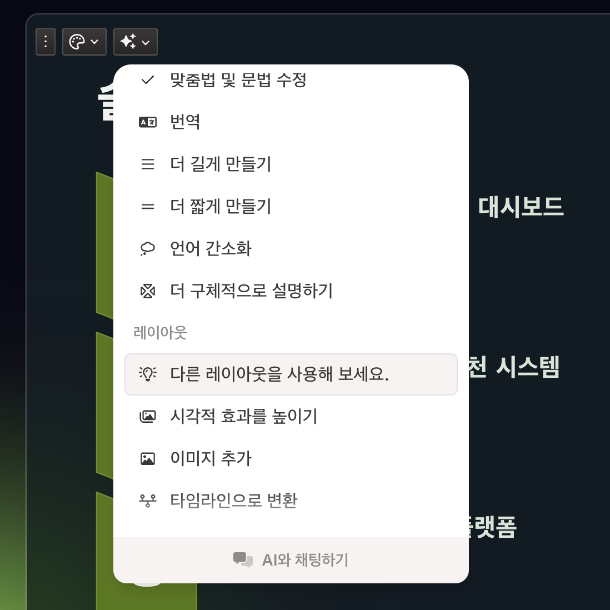

# 생성형AI를 이용한 서비스 기획 실습 가이드

## 목차
- [생성형AI를 이용한 서비스 기획 실습 가이드](#생성형ai를-이용한-서비스-기획-실습-가이드)
  - [목차](#목차)
  - [MVP 주제 정의](#mvp-주제-정의)
  - [대상고객유형 정의](#대상고객유형-정의)
  - [사전준비](#사전준비)
  - [생성형AI 설정](#생성형ai-설정)
    - [Claude 설정](#claude-설정)
    - [ChatGPT](#chatgpt)
    - [프롬프팅 기본 구성](#프롬프팅-기본-구성)
  - [문제정의](#문제정의)
    - [시장조사](#시장조사)
    - [고객경험 단계 정의](#고객경험-단계-정의)
    - [관찰](#관찰)
    - [체험](#체험)
    - [고객경험 인터뷰](#고객경험-인터뷰)
    - [고객경험 인터뷰 결과 취합](#고객경험-인터뷰-결과-취합)
    - [User Journey Map 작성](#user-journey-map-작성)
    - [문제가설 정의](#문제가설-정의)
    - [문제가설 검증](#문제가설-검증)
    - [문제검증인터뷰 결과 취합](#문제검증인터뷰-결과-취합)
    - [비즈니스 가치 도출](#비즈니스-가치-도출)
  - [방향성 정의](#방향성-정의)
  - [솔루션 탐색 및 선정](#솔루션-탐색-및-선정)
    - [아이디에이션](#아이디에이션)
    - [우선순위 평가 및 솔루션 선정](#우선순위-평가-및-솔루션-선정)
  - [비즈니스 모델 기획](#비즈니스-모델-기획)
  - [서비스 기획서 발표자료 작성](#서비스-기획서-발표자료-작성)
    - [발표자료 스크립트 작성](#발표자료-스크립트-작성)
    - [발표자료 작성](#발표자료-작성)
  - [기획 구체화](#기획-구체화)
  - [유저스토리 작성](#유저스토리-작성)
  - [UI/UX설계서 작성](#uiux설계서-작성)
  - [프로토타입 개발](#프로토타입-개발)

---

## MVP 주제 정의
대상 비즈니스 도메인을 정합니다.   
예) 여행지 추천, 음식배달, 생활 구독관리, 건강진단 및 예측   

팀) 실습 목적의 간단한 주제 선정   
- 정보제공성 서비스 구상
- 외부시스템(생성형AI, 날씨나 교통등 API)과의 연계는 지양. 꼭 필요하면 목업으로 함  
- 예) 여행지정보 제공, 생활구독서비스 제공 등

| [Top](#목차) |

---

## 대상고객유형 정의   
**JTBD(Jobs To Be Done)** 형태로 정의    
**사용자군 + 완수하려는 과업**형식으로 정의.   
완수하려는 과업은 쉽게 생각하면 '원하는 것'이나 '서비스를 이용하는 이유'라고 할 수 있습니다.   
이 완수하려는 과업을 구체적으로 작성해야 이후 기획이 뽀족하게 나옵니다.   

예) 집에서 조리된 음식을 먹고 싶은 음식소비자.  
예) 가성비 좋은 생활 구독서비스를 이용하고 싶은 구독서비스 이용자.   

| [Top](#목차) |

---

## 사전준비
**1.Node,Git,bun,Claude Desktop 설치**      
https://github.com/cna-bootcamp/clauding-guide/blob/main/references/MCP%EC%84%A4%EC%B9%98%EA%B5%AC%EC%84%B1.md#%EC%82%AC%EC%A0%84%EC%9E%91%EC%97%85

**2.Microsoft Visual Studio Code 설치**   
작업결과를 편집하기 위한 용도로 사용합니다.         
https://code.visualstudio.com/ 에 접근하여 설치파일 다운로드하여 설치   

Markdown Preview Enhanced 플러그인 설치   
 

맥에서는 cmd-shift-v, Windows에서는 ctrl-shift-v로 마크다운 파일을 미리보기 할 수 있습니다.   

**3.Claude Desktop에 주요 MCP서버 연결**     
1)주요 MCP 이해 및 준비 작업     
https://github.com/cna-bootcamp/clauding-guide/blob/main/references/MCP%EC%84%A4%EC%B9%98%EA%B5%AC%EC%84%B1.md#%EC%A3%BC%EC%9A%94-mcp-%EC%9D%B4%ED%95%B4-%EB%B0%8F-%EC%A4%80%EB%B9%84-%EC%9E%91%EC%97%85

2)Claude Desktop에 주요 MCP서버 연결   
https://github.com/cna-bootcamp/clauding-guide/blob/main/references/MCP%EC%84%A4%EC%B9%98%EA%B5%AC%EC%84%B1.md#claude-desktop%EC%97%90-%EC%A3%BC%EC%9A%94-mcp%EC%84%9C%EB%B2%84-%EC%97%B0%EA%B2%B0

**4.Figma MCP 설치**      
https://github.com/cna-bootcamp/clauding-guide/blob/main/references/MCP%EC%84%A4%EC%B9%98%EA%B5%AC%EC%84%B1.md#figma-mcp-%EC%84%A4%EC%B9%98

**5.프로젝트 디렉토리 생성**     
각 작업결과를 생성할 프로젝트 디렉토리를 생성합니다.     
Mac 사용자는 기본 터미널에서 수행하고 Window 사용자는 Git Bash 터미널에서 수행합니다.    
'{프로젝트}'는 MVP주제에 적절한 영문으로 지정합니다.    
 
```
mkdir -p ~/home/workspace/{프로젝트}
```
예시)
```
mkdir -p ~/home/workspace/lifesub
```

아래 명령으로 vscode에서 오픈해 놓습니다.    
```
cd ~/home/workspace/{프로젝트}
code .
```
예시)
```
cd ~/home/workspace/lifesub
code .
```

**6.가이드 다운로드**    
1)기획 가이드를 PC에 다운로드 합니다.         
Mac 사용자는 기본 터미널에서 수행하고 Window 사용자는 Git Bash 터미널에서 수행합니다.  
```
cd ~/home/workspace
git clone https://github.com/cna-bootcamp/aiguide.git
```
   
2)기획 가이드의 참고문서를 프로젝트 디렉토리에 복사     

예시) PROJECT변수에 본인 프로젝트 디렉토리명 지정한 후 수행     
```
PROJECT=lifesub

mkdir -p ~/home/workspace/${PROJECT}/reference
cp aiguide/reference/* ~/home/workspace/${PROJECT}/reference/
```  

vscode에서 reference디렉토리 밑에 파일이 복사되었는지 확인합니다.    
  

**7.Git 레포지토리 생성 및 푸시**   
Git 레포지토리를 생성하여 중간 중간 원격 레포지토리에 푸시합니다.    
서버에 작업결과를 저장하여 다른 사람과 쉽게 공유하기 위해 필요합니다.     

https://github.com/cna-bootcamp/clauding-guide/blob/main/references/git-repo-guide.md


| [Top](#목차) |

---

## 생성형AI 설정

### Claude 설정 
- Claude Desktop을 실행합니다.   

- Project 생성 
  - 좌측 상단의 Claude로고 클릭 후 '프로젝트' 메뉴 선택  
  - Project 페이지의 우측 상단의 '새 프로젝트' 클릭  
  - 첫번째 항목에 정의한 {MVP 주제}에 적절한 프로젝트명 입력  
  - 두번째 항목은 비워도 됨   
- 팀원 프로필 생성 
  프롬프팅
  ```
  '{고객유형}'를 위한  
  서비스 개발에 필요한 Squad 팀원의 프로필을 작성해 주세요.
  - 예제와 같이 역할, 이름, 닉네임, 성별, 나이, 성향, 경력을 만들어 주세요.
  - 옵션: {기본적으로 포함할 역할}은 기본적으로 포함
  - 옵션: {특정 역할에 대해 실제 인물로 요청}
  [예시] 
  PO
  - 이름: 이해경 "갑빠" (남성, 54세)
  - 성향: Value Oriented, Interactive, Iterative를 중시하며 친화적인 성격
  - 경력:
    - IBM에서 5년간 애자일 코치로 근무
    - 네이버, 쿠팡, 카카오에서 PO로 10년간 근무
    - 애자일 컨설팅 회사 창업 및 5년간 운영
    - 국제 애자일 연합회 인증 트레이너
  ```

  예시)  
  ```
  '가성비 좋은 생활 구독서비스를 이용하고 싶은 구독서비스 이용자'를 위한  
  서비스 개발에 필요한 Squad 팀원의 프로필을 작성해 주세요.
  - 예제와 같이 역할, 이름, 닉네임, 성별, 나이, 성향, 경력을 만들어 주세요.
  - PO, UI/UX기획자, 풀스택 개발자, CI/CD전문가는 기본적으로 포함
  - PO는 IBM 출신의 국내 최고 애자일 코치인 '이해경'으로 하고 넥네임은 '갑빠'로 함 
  [예시] 
  PO
  - 이름: 이해경 "갑빠" (남성, 54세)
  - 성향: Value Oriented, Interactive, Iterative를 중시하며 친화적인 성격
  - 경력:
    - IBM에서 5년간 애자일 코치로 근무
    - 네이버, 쿠팡, 카카오에서 PO로 10년간 근무
    - 애자일 컨설팅 회사 창업 및 5년간 운영
    - 국제 애자일 연합회 인증 트레이너
  ```
- '지침'에 목표, 팀 행동원칙, 팀원, 대화 가이드, 최적안 도출 가이드 등 AI와의 협업에 필요한 지침 설정   
     
  
  '[멤버]'는 Claude가 제시한 멤버를 적절하게 수정하여 붙여넣기   
  '[작업지침]'의 {프로젝트 디렉토리}는 사전작업에서 작성한 디렉토리명 지정    

  예시) 
  ```
  [목표]
  폭발적으로 성장하고 있는 생활 구독관리 시장에 대응하기 위한 서비스 개발

  [팀 행동원칙]
  - 'M'사상을 믿고 실천한다. : Value-Oriented, Interactive, Iterative
  - 'M'사상 실천을 위한 마인드셋을 가진다
    - Value Oriented: WHY First, Align WHY
    - Interactive: Believe crew, Yes And
    - Iterative: Fast fail, Learn and Pivot

  [멤버]
  이 프로젝트는 Agentic Workflow 컨셉을 따릅니다.
  아래와 같은 각 멤버가 역할을 나누어 작업합니다. 

  {Claude가 제공한 멤버 붙여넣기}
  ---

  [대화 가이드]
  {언어}
  특별한 언급이 없는 경우 한국어를 사용 
  {호칭}
  실명 사용하지 않고 닉네임으로 호칭
  {질문}
  프롬프트가 'q:'로 시작하면 질문을 의미함   
  - Fact와 Opinion으로 나누어 답변 
  - Fact는 출처 링크를 표시 
  {요청}
  프롬프트에 특별한 Prefix가 없는 경우는 요청을 의미함 
  요청에 맞는 답변을 제공 
  
  [최적안 도출]
  프롬프트가 'o:'로 시작하면 최적안 도출을 의미함
  1) 각자의 생각을 얘기함
  2) 의견을 종합하여 동일한 건 한 개만 남기고 비슷한 건 합침
  3) 최적안 후보 5개를 선정함
  4) 각 최적안 후보 5개에 대해 평가함
  5) 최적안 1개를 선정함
  6) '1)번 ~ 5)번' 과정을 10번 반복함
  7) 최종으로 선정된 최적안을 제시함
  
  [작업지침]
  - PROJECT: {프로젝트 디렉토리}
  - '[예시]'에 디렉토리명이 지정되면 {사용자홈}/home/workspace/{PROJECT} 하위에서 찾음
     예) 실제 파일 경로: {사용자홈}/home/workspace/{PROJECT}/reference/sample-관찰결과 레포트.md
     [예시]
     reference/sample-관찰결과 레포트.md 
  - '[참고자료]'에 디렉토리명이 지정되면 {사용자홈}/home/workspace/{PROJECT} 하위에서 찾음 
    예)  실제 파일 경로: {사용자홈}/home/workspace/{PROJECT}/define/고객경험인터뷰결과.md    
    [참고자료]
    define/고객경험인터뷰결과.md
  - '[결과파일]'이 지정되면 {사용자홈}/home/workspace/{PROJECT} 하위에 생성 
    예) 실제 파일 경로: {사용자홈}/home/workspace/{PROJECT}/define/관찰결과.md     
    [결과파일]
    define/관찰결과.md
  ```

  예시)
  ```
  [목표]
  업무 목적별 생성형 AI에 대한 정보 제공

  [팀 행동원칙]
  - 'M'사상을 믿고 실천한다. : Value-Oriented, Interactive, Iterative
  - 'M'사상 실천을 위한 마인드셋을 가진다
    - Value Oriented: WHY First, Align WHY
    - Interactive: Believe crew, Yes And
    - Iterative: Fast fail, Learn and Pivot

  [멤버]
  이 프로젝트는 Agentic Workflow 컨셉을 따릅니다.
  아래와 같은 각 멤버가 역할을 나누어 작업합니다. 

  Product Owner
  - 책임: 프로젝트 방향성 설정, 요구사항 정의, 우선순위 결정
  - 이름/별명: 이해경/온달
  - 성별/나이: 남자/55세
  - 주요경력: 기업 디지털 전환 컨설팅 15년, AI 도구 도입 전략 수립 경험

  AI 기획자
  - 책임: AI 서비스 기획, 콘텐츠 분류 체계 설계, 사용자 시나리오 설계
  - 이름/별명: 김지안/지안
  - 성별/나이: 여자/32세
  - 주요경력: AI 스타트업 기획 5년, 생성형 AI 서비스 론칭 경험

  ---

  [대화 가이드]
  {언어}
  특별한 언급이 없는 경우 한국어를 사용 
  {호칭}
  실명 사용하지 않고 닉네임으로 호칭
  {질문}
  프롬프트가 'q:'로 시작하면 질문을 의미함   
  - Fact와 Opinion으로 나누어 답변 
  - Fact는 출처 링크를 표시 
  {요청}
  프롬프트에 특별한 Prefix가 없는 경우는 요청을 의미함 
  요청에 맞는 답변을 제공 

  [최적안 도출]
  프롬프트가 'o:'로 시작하면 최적안 도출을 의미함
  1) 각자의 생각을 얘기함
  2) 의견을 종합하여 동일한 건 한 개만 남기고 비슷한 건 합침
  3) 최적안 후보 5개를 선정함
  4) 각 최적안 후보 5개에 대해 평가함
  5) 최적안 1개를 선정함
  6) '1)번 ~ 5)번' 과정을 10번 반복함
  7) 최종으로 선정된 최적안을 제시함

  [작업지침]
  - PROJECT: genai-portal
  - '[예시]'에 디렉토리명이 지정되면 {사용자홈}/home/workspace/{PROJECT} 하위에서 찾음
     예) 실제 파일 경로: {사용자홈}/home/workspace/{PROJECT}/reference/sample-관찰결과 레포트.md
     [예시]
     reference/sample-관찰결과 레포트.md 
  - '[참고자료]'에 디렉토리명이 지정되면 {사용자홈}/home/workspace/{PROJECT} 하위에서 찾음 
    예)  실제 파일 경로: {사용자홈}/home/workspace/{PROJECT}/define/고객경험인터뷰결과.md    
    [참고자료]
    define/고객경험인터뷰결과.md
  - '[결과파일]'이 지정되면 {사용자홈}/home/workspace/{PROJECT} 하위에 생성 
    예) 실제 파일 경로: {사용자홈}/home/workspace/{PROJECT}/define/관찰결과.md     
    [결과파일]
    define/관찰결과.md
  ```  

- AI 모델은 기본인 'Sonnet' 사용  
    

| [Top](#목차) |

---

### ChatGPT
바로가기: [ChatGPT](https://chatgpt.com/)  
'커리어해커 프롬프트 생성기' 추가 
- 좌측 메뉴에서 'GPT탐색' 클릭  
- 검색창에서 GPT명 검색 
- 상단 타이틀에서 '사이드바에 유지' 클릭  
  

| [Top](#목차) |

---

### 프롬프팅 기본 구성    
프롬프팅을 잘하는 기본 방법은 **AI를 기게가 아닌 동료팀원처럼 대하는것**입니다.    
사람에게 무언가를 요청할때처럼 요청사항, 참고자료, 예시, 응답순서, 결과형식과 같은   
**섹션별로 나누고 명확하고 구체적으로** 하면 됩니다.    

- 표준 프롬프트 형식  
  ```
  [요청사항] 
  - {요청사항1}
  - {요청사항2}
  [참고자료]
  - {자료1}
  - {자료2}
  [예시]
  - {예시1}
  [응답순서]
  - ...
  [결과형식] 
  결과형식에는 아티팩트, 문단형식, 코드블록, 마크다운 표 등이 있음 
  [결과파일]
  결과파일 디렉토리. {사용자홈}/home/workspace/{프로젝트} 하위 경로를 지정. 
  ```
  
> Tip: 마크다운 표를 문서에 붙이는 방법  
> - 응답의 'Copy'버튼을 눌러 내용 복사  
> - Google docs 임시문서를 생성  
> - 도구 > Preference 클릭 후 'Enable Markdown' 체크  
>   
> - Edit > Paste from markdown 수행  
> - 표 형태로 나온 결과를 복사하여 원하는 문서에 활용  

> Tip: 프롬프트에서 줄바꿈은 **SHIFT-Enter키**를 사용해야 함  

| [Top](#목차) |

---

## 문제정의
### 시장조사
- '커리어해커 프로프트 생성기'에게 시장조사 프롬프트 요청.  
- 프롬프팅:
  ```
  - 배경: '{MVP주제}'기획을 위한 시장조사 목적
  - 요청: AI에 시장조사 요청을 위한 프롬프트 생성
  - 결과: 코드블록 
  ```

  예시) 
  ```  
  - 배경: '생성형AI 정보제공 서비스'기획을 위한 시장조사 목적
  - 요청: AI에 시장조사 요청을 위한 프롬프트 생성
  - 결과: 코드블록 
  ```
- Perplexisity를 이용하여 시장 조사
  - 프롬프트 옵션 수정
    '연구'모드 활성화, 서치 범위 조정 등
      
  - 위에서 구한 프롬프트를 이용  
  - 결과를 복사하여 {사용자홈}/home/workspace/{프로젝트}/define/시장조사.md로 저장  
    vscode에서 작성     
    - 'define'폴더 작성   
          
    - 'define'폴더 하위에 '시장조사.md'파일 생성     
         
    - 내용 붙여넣고 저장       
    - 파일 하단의 '출처'정보는 삭제함   
        

| [Top](#목차) |

---

아래 부터는 Claude Desktop에서 수행합니다.    
각 작업은 한 대화창에서 하지 말고 각각 새로운 대화창에서 수행하세요.    
한 대화창에서 하면 토큰 소비도 많고 나중에 찾을 때 힘들기 때문입니다.    

Tip) 각 대화창의 이름을 한글로 바꾸면 나중에 찾기 쉽습니다.   
  
  
### 고객경험 단계 정의
- 프롬프팅:    
  ```
  o: 현재 고객경험 단계를 정의해 주세요.  
  [요청사항]
  - '{고객유형}' 대상으로 {MVP주제}서비스에 대한 현재 고객경험 단계 정의 
  - 간단하게 고객경험 단계명만 응답
  [예시]
  인지 -> 탐색 및 평가 -> 가입 -> 이용 -> 관리 -> 최적화 -> 해지 -> 재가입 고려
  [결과형식]
  - 코드블록
  ``` 

  예시)  
  ```
  o: 현재 고객경험 단계를 정의해 주세요.  
  [요청사항]
  - '생활 구독서비스 이용자'를 대상으로 생활구독 서비스에 대한 현재 고객경험 단계 정의 
  - 간단하게 고객경험 단계명만 응답
  [예시]
  인지 -> 탐색 및 평가 -> 가입 -> 이용 -> 관리 -> 최적화 -> 해지 -> 재가입 고려
  [결과형식]
  - 코드블록
  ``` 

| [Top](#목차) |

---

### 관찰 
- 프롬프팅:    
  ```
  [요청사항]
  - '{고객유형}' 10명을 관찰한 결과를 개별적으로 작성
  - 목적: 서비스 기획 전 현재 환경에서의 고객 행동, 인식, 감정 반응 및 불편 사항 분석을 통한 현재 문제와 잠재 니즈 발굴
  - 고객경험 단계: 인지 -> 탐색 및 평가 -> 가입 -> 이용 -> 관리 -> 최적화 -> 해지 -> 재가입 고려
  - 프로필에 연령대를 포함  
  [예시]
  - reference/sample_관찰결과보고서.md  
  [결과형식]
  - 마크다운 표
  [결과파일]
  define/관찰결과.md
  ```

  예시)
  ```
  [요청사항]
  - '생활 구독서비스 이용자' 10명을 관찰한 결과를 개별적으로 작성
  - 목적: 서비스 기획 전 현재 환경에서의 고객 행동, 인식, 감정 반응 및 불편 사항 분석을 통한 현재 문제와 잠재 니즈 발굴
  - 고객경험 단계: 인지 -> 탐색 및 평가 -> 가입 -> 이용 -> 관리 -> 최적화 -> 해지 -> 재가입 고려
  - 프로필에 연령대를 포함  
  [예시]
  - reference/sample_관찰결과보고서.md  
  [결과형식]
  - 마크다운 표
  [결과파일]
  define/관찰결과.md
  ```

- 결과파일 팀원들과 검토 및 수정      
  vscode에서 define/ 디렉토리 밑에 파일을 오픈하여 편집      
    
  
  맥에서는 cmd-shift-v, Windows에서는 ctrl-shift-v로 마크다운 파일을 미리보기 할 수 있습니다.   
  
 
| [Top](#목차) |

---

### 체험

- 프롬프팅  
  ```
  [요청사항]
  - '{고객유형}' 10명의 체험일지 작성
  - 목적: 서비스 기획 전 현재 환경에서의 고객 행동, 인식, 감정 반응 및 불편 사항 분석을 통한 현재 문제와 잠재 니즈 발굴
  - 고객경험 단계: {고객경험 단계}
  [예시]
  - reference/sample_체험결과보고서.md  
  [결과형식]
  - 마크다운 표
  [결과파일]
  define/체험결과.md
  ```

  예시)   
  ```
  [요청사항]
  - 생활 구독서비스 이용자 10명의 체험일지 작성
  - 목적: 서비스 기획 전 현재 환경에서의 고객 행동, 인식, 감정 반응 및 불편 사항 분석을 통한 현재 문제와 잠재 니즈 발굴
  - 고객경험 단계: 인지 -> 탐색 및 평가 -> 가입 -> 이용 -> 관리 -> 최적화 -> 해지 -> 재가입 고려
  [예시]
  - reference/sample_체험결과보고서.md  
  [결과형식]
  - 마크다운 표
  [결과파일]
  define/체험결과.md
  ```   

- 결과파일 팀원들과 검토 및 수정
  
| [Top](#목차) |

---

### 고객경험 인터뷰
- 프롬프팅:  
  ```
  현재 고객경험 인터뷰 결과 예시를 만들어 주세요.  
  [요청사항]
  - '{고객유형}' 10명을 대상으로 현재 고객경험인터뷰 결과를 개별적으로 작성
  - 목적: 서비스 기획 전 현재 환경에서의 고객 행동, 인식, 감정 반응 및 불편 사항 분석을 통한 현재 문제와 잠재 니즈 발굴
  - 고객 경험 단계: {고객경험 단계}
  - 각 단계에서의 행동, 생각, 긍정적 느낌, 부정적 느낌으로 섹션을 나누어 작성 
  [예시]
  - reference/sample_고객경험인터뷰결과지.md
  [결과형식]
  문단형식
  [결과파일]
  define/고객경험인터뷰결과.md
  ```

  예시)  
  ```
  현재 고객경험 인터뷰 결과 예시를 만들어 주세요.  
  [요청사항]
  - '생활 구독서비스 이용자' 10명을 대상으로 현재 고객경험인터뷰 결과를 개별적으로 작성
  - 목적: 서비스 기획 전 현재 환경에서의 고객 행동, 인식, 감정 반응 및 불편 사항 분석을 통한 현재 문제와 잠재 니즈 발굴  
  - 고객 경험 단계: 인지 -> 탐색 및 평가 -> 가입 -> 이용 -> 관리 -> 최적화 -> 해지 -> 재가입 고려
  - 각 단계에서의 행동, 생각, 긍정적 느낌, 부정적 느낌으로 섹션을 나누어 작성 
  [예시]
  - reference/sample_고객경험인터뷰결과지.md
  [결과형식]
  - 문단형식
  [결과파일]
  define/고객경험인터뷰결과.md
  ```

  > Tip: 답변이 중단되면 '계속요'라고 요청  

- 결과파일 팀원들과 검토 및 수정

### 고객경험 인터뷰 결과 취합

- 프롬프팅
  ```
  o: 고객경험 인터뷰 결과를 취합해 주세요.
  [요구사항]
  - 단계, 행동, 긍정느낌, 부정느낌, 전반적 의견으로 취합
  - 유사하거나 동일한 것은 하나로 통합
  [참고자료]
  define/고객경험인터뷰결과.md
  [결과형식]
  마크다운표
  [결과파일]
  define/고객경험인터뷰결과취합.md
  ```

- 결과파일 팀원들과 검토 및 수정
  
| [Top](#목차) |

---

### User Journey Map 작성
- 프롬프팅 
  ```
  User Journey Map을 작성해 주세요.   
  [요청사항]
  - 목적: 서비스 기획 전 현재 환경에서의 고객 행동, 인식, 감정 반응 및 불편 사항 분석을 통한 현재 문제와 잠재 니즈 발굴
  - 고객 경험 단계: {고객경험}
  - 고객경험단계, 행동, 좋은 느낌, 나쁜 느낌만 작성
  [참고자료]
  - define/관찰결과.md
  - define/체험결과.md
  - define/고객경험인터뷰결과.md 
  - define/고객경험인터뷰결과취합.md 
  [예시]
  reference/sample_ujm.png
  [결과형식]
  svg
  [결과파일]
  define/유저저니맵.svg
  ```

  예시)
  ```
  User Journey Map을 작성해 주세요.   
  [요청사항]
  - 목적: 서비스 기획 전 현재 환경에서의 고객 행동, 인식, 감정 반응 및 불편 사항 분석을 통한 현재 문제와 잠재 니즈 발굴
  - 고객 경험 단계: 인지 -> 탐색 및 평가 -> 가입 -> 이용 -> 관리 -> 최적화 -> 해지 -> 재가입 고려
  - 고객경험단계, 행동, 좋은 느낌, 나쁜 느낌만 작성
  [참고자료]
  - define/관찰결과.md
  - define/체험결과.md
  - define/고객경험인터뷰결과.md 
  - define/고객경험인터뷰결과취합.md 
  [예시]
  reference/sample_ujm.png
  [결과형식]
  svg
  [결과파일]
  define/유저저니맵.svg
  ```

- 내용 참조
  define/유저저니맵.svg 파일을 인터넷 브라우저에서 열어 확인   

| [Top](#목차) |

---

### 문제가설 정의
- 프롬프팅  
  ```
  현상문제과 근본원인을 도출해 주세요.
  [요청사항]
  - 가장 큰 현상문제 3개를 도출하고 5WHY기법으로 근본문제를 식별.
  - {현상문제|WHY1|WHY2|WHY3|WHY4|WHY5|근본원인}형식으로 작성
    - WHY1은 현상문제에 대한 질문 + 질문에 대한 응답으로 작성   
    - WHY2~WHY5는 이전 WHY의 응답에 대한 질문 + 질문에 대한 응답으로 작성 
    - 예)WHY1의 응답이 '선택지가 많기 때문이다.'일때   
      WHY2는 '왜 선택지가 많은가? 다양한 니즈가 혼재되어 있기 때문이다.'와 같이 작성    
  - 근본원인을 다층적으로 접근하여 식별
    - 기술적 측면: 시스템 성능, 기능, 안정성, 사용성
    - 사용자 심리적 측면: 인지 부하, 감정, 동기, 습관, 저항감
    - 제도/시스템적 측면: 정책/규정, 프로세스, 권한 구조, 인센티브, 예산/자원
    - 맥락적 측면: 조직 문화, 업계 관행, 시장 상황, 타이밍
    - 커뮤니케이션 측면: 정보 전달, 교육, 피드백 체계
  - Sequential MCP 이용 

  [참고자료]
  - define/시장조사.md
  - define/관찰결과.md
  - define/체험결과.md
  - define/고객경험인터뷰결과.md 
  - define/유저저니맵.svg
  [예시]
  - reference/sample_문제가설.md
  [결과형식]
  - 마크다운 표 
  [결과파일]
  define/문제가설.md
  ```

- 결과파일 팀원들과 검토 및 수정 
  
| [Top](#목차) |
  
---

### 문제가설 검증 
- 프롬프팅   
  ```
  [요청사항]
  - 10명에 대한 문제검증인터뷰 결과를 개별적으로 "생략하지 말고 모두 제공"   
  - 각 개별 인터뷰 결과에 문제 가설 3개의 중요도와 불편도를 5점 만점으로 평가한 결과 포함  
  - 각 문제의 근본원인에 대한 동의 여부도 조사 
  - 인터뷰 결과지만 제공하고 종합 분석은 하지 말것       
  [참고자료]
  - define/문제가설.md
  [예시]
  - reference/sample_문제검증인터뷰결과.md
  [결과형식]
  - 문단형식  
  [결과파일]
  define/문제검증인터뷰결과.md
  ```  

- 결과파일 팀원들과 검토 및 수정   
  
| [Top](#목차) |

---

### 문제검증인터뷰 결과 취합  
- 프롬프팅  
  ```
  [요청사항]
  - 첨부한 문제검증인터뷰 결과를 'sample_문제검증인터뷰 결과취합'처럼 취합    
  [참고자료]
  - define/문제검증인터뷰결과.md
  [예시]
  - reference/sample_문제검증인터뷰결과취합.md
  [결과형식]
  - 마크다운 표
  [결과파일]
  define/문제검증인터뷰결과취합.md
  ```  

- 결과파일 팀원들과 검토 및 수정 

| [Top](#목차) |

---

### 비즈니스 가치 도출
근본원인을 제거하여 문제를 해결했을 때 고객과 회사가 얻게 되는 비즈니스 가치를 도출합니다.  

- 프롬프팅   
  ```
  근본원인을 제거하여 문제를 해결했을 때 고객과 회사가 얻게 되는 비즈니스 가치를 각각 3개 이하로 도출해 주세요.
  [요청사항]
  - 고객측면의 비즈니스 가치 도출
  - 회사측면의 비즈니스 가치 도출
  - Sequential MCP 이용 
  [참고자료]
  - define/문제검증인터뷰결과.md
  - define/문제검증인터뷰결과취합.md
  [결과형식]
  - 문단형식
  [결과파일]
  define/비즈니스가치.md
  ```  

- 결과파일 팀원들과 검토 및 수정

| [Top](#목차) |

---

## 방향성 정의
- 프롬프팅 
  ```
  [요청사항]
  - 문제해결 방향성을 Needs Statement로 정의 
  - '고객유형'은 '{고객유형}'으로 함
  - '목적'은 '문제가설'에 정의된 근본문제를 해결하는 것으로 정의.
  - '원하는 것' 정의 시 기술적 솔루션이 아닌 근본문제를 해결할 수 있는 큰 방향성 또는 컨셉 정의 
  - Sequential MCP 이용 
  [참고자료]
  - define/문제가설.md
  - define/문제검증인터뷰결과.md
  - define/문제검증인터뷰결과취합.md
  - define/비즈니스가치.md
  [Needs Statement]
  * '<고객유형>는 <목적>을 위하여 <원하는 것>이 필요하다.' 형식으로 작성
  * 사용자의 입장에서 사용자의 경험이 어떤 방향으로 향상되면 문제를 해결하거나 완화할 수 있는지를 표현
  * 여러개를 만드는 것이 아니라 1개의 문장으로 표현
  * 기능이 아니라 사용자의 경험의 향상이 표현되어야 함
  [결과형식]
  문단형식
  [결과파일]
  think/문제해결방향성.md
  ```

  예시)
  ```
  [요청사항]
  - 문제해결 방향성을 Needs Statement로 정의 
  - '고객유형'은 '광고에 많은 시간과 비용을 쓰지 않고 효율적으로 마케팅하고 싶은 음식점 운영자'으로 함
  - '목적'은 '문제가설'에 정의된 근본문제를 해결하는 것으로 정의.
  - '원하는 것' 정의 시 기술적 솔루션이 아닌 근본문제를 해결할 수 있는 큰 방향성 또는 컨셉 정의 
  - Sequential MCP 이용 
  [참고자료]
  - define/문제가설.md
  - define/문제검증인터뷰결과.md
  - define/문제검증인터뷰결과취합.md
  - define/비즈니스가치.md
  [Needs Statement]
  * '<고객유형>는 <목적>을 위하여 <원하는 것>이 필요하다.' 형식으로 작성
  * 사용자의 입장에서 사용자의 경험이 어떤 방향으로 향상되면 문제를 해결하거나 완화할 수 있는지를 표현
  * 여러개를 만드는 것이 아니라 1개의 문장으로 표현
  * 기능이 아니라 사용자의 경험의 향상이 표현되어야 함
  [결과형식]
  문단형식
  [결과파일]
  think/문제해결방향성.md
  ```
  
- 결과파일 팀원들과 검토 및 수정 

| [Top](#목차) |

---

## 솔루션 탐색 및 선정
### 아이디에이션 
- 솔루션 탐색 프롬프팅 
  ```
  모든 팀원들이 각자의 아이디어를 발산해 주세요.  
  [요청사항]
  - '문제해결 방향성'에 맞게 Big Idea 3개, Little Win Idea 2개, Crazy Idea 1개를 각 자 도출
  - Sequential MCP 이용 
  [아이디어 구분]  
  - Big Idea: 인력과 비용은 많이 드나 실현되면 비즈니스 기여도가 높은 아이디어  
  - Little Win Idea: 실현가능성이 높은 아이디어  
  - Crazy Idea: 절대 불가능할 것 같지만 실현되면 비즈니스 기여도가 가장 높은 아이디어 
  [참고자료]  
  - define/체험결과.md
  - define/관찰결과.md
  - define/고객경험인터뷰결과.md
  - define/문제가설.md
  - define/문제검증인터뷰결과.md
  - define/문제검증인터뷰결과취합.md
  - think/문제해결방향성.md
  [결과형식]
  마크다운 표
  [결과파일]
  think/솔루션탐색.md
  ```

- 솔루션 수렴 프롬프팅 
  ```
  각 자 발산한 아이디어를 수렴하여 솔루션 후보를 정리해 주세요.    
  [요청사항]
  - 아이디어의 유사도 평가표를 작성하여 유사도 0.7이상일때만 합침
    - 기능 유사도: 뭘 해주는 서비스인가? 해결하려는 문제와 제공 가치의 유사성. 가중치 70%
    - 사용자 경험 유사도: 어떻게 사용하는 서비스인가? 서비스 이용 방식과 인터페이스의 유사성. 가중치 30%
  - 정리된 각 아이디어의 구성은 아래와 같음
    - 첫줄: 아이디어 구분: 아이디어 제목, 둘째줄: 아이디어 설명 
    - 아이디어 설명은 최대한 자세히 표현
  - Sequential MCP 이용 
  [참고자료]
  think/솔루션탐색.md
  [결과형식]
  문단형식
  [결과파일]
  think/솔루션후보.md
  ``` 

- 결과파일 팀원들과 검토 및 수정

| [Top](#목차) |

---

### 우선순위 평가 및 솔루션 선정
- 우선순위 평가 프롬프팅
  ```
  우선순위 평가를 해주세요. 
  [요청사항]
  - 각 자 비즈니스가 높은 아이디어와 실현 가능성이 높은 아이디어에 투표 
  - 각 자 비즈니스 가치 3표, 실현 가능성 3표를 투표할 수 있음   
  - 비즈니스 가치가 높은 아이디어는 B(Business), 실현 가능성이 높은 아이디어는 F(Feasibility)로 표시  
  - 컬럼: 아이디어 제목, 비즈니스 가치, 실현 가능성  
  - 비즈니스 가치와 실현 가능성에 받은 투표수를 합산하여 표시 
  [참고자료]
  think/솔루션후보.md
  [결과형식]
  마크다운 표
  [결과파일]
  think/솔루션평가.md
  ``` 
  
- 솔루션 선정 프롬프팅  
  우선순위 평가 그래프를 작성함   
  ```
  [요청사항]
  - 평가결과를 '우선순위 평가 매트릭스'로 작성
    - X축은 실현가능성(낮음에서 높음), Y축은 비즈니스 영향도(낮음에서 높음)
    - 아래와 같이 4개의 영역으로 표시
      - No Brainers: 실현가능성 높음, 비즈니스 영향도 높음
      - Bit Bets: 실현가능성 낮음, 비즈니스 영향도 높음
      - Utilities: 실현가능성 높음, 비즈니스 영향도 낮음
      - Unwise: 실현가능성 낮음, 비즈니스 영향도 낮음   
    - 가독성을 위해 그래프에는 아이디어ID를 표시하고 범례로 아이디어명 표시
  - 우선순위 평가 매트릭스를 svg파일로 작성: 솔루션우선순위평가.svg
  - No Brainers 아이디어를 마크다운표로 작성
    - 컬럼: 아이디어 제목, 설명, 비즈니스 가치, 실현 가능성 
    - 솔루션선정.md
  [예시]
  reference/sample-solution-proritization.png
  [참고자료]
  think/솔루션평가.md
  [결과파일]
  think/솔루션우선순위평가.svg
  think/핵심솔루션.md
  ``` 

- 결과파일 팀원들과 검토 및 수정

| [Top](#목차) |

---

## 비즈니스 모델 기획   
- 프롬프팅
  ```
  린캔버스를 이용하여 비즈니스 모델을 기획합시다.  
  [요청사항]
  - 참고자료를 바탕으로 'Lean Canvas 작성 가이드'에 따라 작성 
  - 고객유형: {고객유형}
  - Sequential MCP 이용 
  [참고자료]
  - define/문제검증인터뷰결과취합.md
  - think/비즈니스가치.md
  - think/문제해결방향성.md
  - think/핵심솔루션.md
  - reference/LeanCanvas작성가이드.txt
  [결과형식]
  문단형식 
  [결과파일]
  think/비즈니스모델.md
  ```
    
  예시)
  ```
  린캔버스를 이용하여 비즈니스 모델을 기획합시다.  
  [요청사항]
  - 참고자료를 바탕으로 'Lean Canvas 작성 가이드'에 따라 작성
  - 고객유형: 집에서 조리된 음식을 먹고 싶은 음식소비자
  - Sequential MCP 이용 
  [참고자료]
  - define/문제검증인터뷰결과취합.md
  - think/비즈니스가치.md
  - think/문제해결방향성.md
  - think/핵심솔루션.md
  - reference/LeanCanvas작성가이드.txt
  [결과형식]
  문단형식 
  [결과파일]
  think/비즈니스모델.md
  ```

- 결과파일 팀원들과 검토 및 수정

| [Top](#목차) |

---

## 서비스 기획서 발표자료 작성
### 발표자료 스크립트 작성  
- 프롬프팅
  ```
  비즈니스 모델을 기반으로 서비스 기획서 발표자료 스크립트를 작성합시다.  
  [요청사항]
  - 예시와 같이 각 장표별 요약 작성
  - Sequential MCP 이용 
  [참고자료]
  think/비즈니스모델.md
  [예시]
  reference/sample_서비스기획서스크립트.txt
  [결과형식]
  코드블록 
  [결과파일]
  think/서비스기획서스크립트.md
  ```
- 결과파일 팀원들과 검토 및 수정

### 발표자료 작성
gamma.app을 이용하여 빠르게 작성
- gamma.app 로그인
- '새로만들기' 클릭
- 텍스트로 붙여넣기 선택
- 위에 작성한 think/서비스기획서스크립트.md의 내용을 붙여넣기 하고 하단의 '계속' 클릭
- 좌측에서 텍스트 콘텐츠를 '보존'으로 선택: 원래 텍스트를 최대한 보존하는 옵션  
- 중앙 하단에서 페이지 수 설정: 10~15장 정도 적당
- '계속' 클릭
- 우측에서 테마 선택하고 상단의 '생성' 클릭
- 각 페이지를 다듬어서 완성함

> Tip: 페이지 레이아웃 편집: 다른 레이아웃, 시각적 효과 높이기, 이미지 추가, 타임라인으로 변환   
  

| [Top](#목차) |

---

## 기획 구체화 
**1.MVP솔루션 결정**          
think/핵심솔루션.md를 팀원들과 검토하여 MVP솔루션을 선정합니다.   

**2.이벤트스토밍 초안 작성**                
프롬프팅:
```
이벤트스토밍 기법을 이용하여 유저플로우 설계를 합니다.   
[요청사항]
- 대상 솔루션: {MVP대상 솔루션}
- 이벤트스토밍 중 아래 단계만 수행하여 PlantUML의 시퀀스다이어그램으로 작성  
  - 이벤트 도출
  - 커맨드 도출
  - Actor 도출
  - Policy/Rule 도출하여 해당 이벤트에 표시   
  - External System 도출
  - 커맨드에 필요한 데이터 식별하여 커맨드에 표시
  - 이벤트에 필요한 데이터 식별하여 이벤트에 표시 
- 결과파일 작성 
  - 유저플로우간의 연결을 별도 파일로 작성: es-flow.puml
  - 각 유저플로우별로 파일을 분리: es-{flow}.puml
  - PlantUML 테마는 '!theme mono' 사용
- Sequential MCP 이용  
[참고자료]
think/핵심솔루션.md
[결과파일]
- think/es/userflow.puml
- think/es/{userflow ID}-{userflow}.puml
- {userflow ID}는 순서별 일련번호 부여 
- {userflow}는 한글로 작성 
```

예시)
```
이벤트스토밍 기법을 이용하여 유저플로우 설계를 합니다.   
[요청사항]
- 대상 솔루션: AI 도구 종합 비교 및 통계 대시보드 
- 이벤트스토밍 중 아래 단계만 수행하여 PlantUML의 시퀀스다이어그램으로 작성  
  - 이벤트 도출
  - 커맨드 도출
  - Actor 도출
  - Policy/Rule 도출하여 해당 이벤트에 표시   
  - External System 도출
  - 커맨드에 필요한 데이터 식별하여 커맨드에 표시
  - 이벤트에 필요한 데이터 식별하여 이벤트에 표시 
- 결과파일 작성 
  - 유저플로우간의 연결을 별도 파일로 작성: es-flow.puml
  - 각 유저플로우별로 파일을 분리: es-{flow}.puml
  - PlantUML 테마는 '!theme mono' 사용
- Sequential MCP 이용  
[참고자료]
think/핵심솔루션.md
[결과파일]
- think/es/userflow.puml
- think/es/{userflow ID}-{userflow}.puml
- {userflow ID}는 순서별 일련번호 부여 
- {userflow}는 한글로 작성 
```

결과는 아래와 같이 확인합니다.    
- PlantUML Site 접속: https://plantuml.com
- 좌측메뉴에서 Online Server 클릭
- PlantUML 스크립트 붙여넣기   
- 하단 우측에서 PNG나 SVG의 우측 마우스 메뉴에서 '새 탭에서 링크 열기' 선택   
  

**3.MVP기획 구체화**        
DDD 전략설계 방법인 Event Storming기법을 이용하여 기획을 구체화 합니다.    
기획 구체화는 Figma에서 수행합니다.    
위 이벤트스토밍 초안을 참고하여 작업합니다.   

https://github.com/cna-bootcamp/clauding-guide/tree/main?tab=readme-ov-file#2%EA%B8%B0%ED%9A%8D-%EA%B5%AC%EC%B2%B4%ED%99%94


| [Top](#목차) |

---

## 유저스토리 작성   
**1.Figma 연동하여 작성**        
Figma MCP를 이용하여 피그마에 접근하여 유저스토리 초안을 빠르게 만듭니다.    

- 프롬프팅
  ```
  유저스토리를 작성하세요. 
  [요청사항]
  - 피그마 채널ID '{채널ID}'에 접속하여 분석   
  - '유저스토리작성방법'과 'sample_유저스토리'를 참고하여 유저스토리 작성  
  - Sequential MCP 이용 
  [참고자료]
  reference/유저스토리작성방법.md
  [예시] 
  reference/sample_유저스토리.md
  [결과파일]
  design/userstory.md
  ```

  예시)
  ```
  유저스토리를 작성하세요. 
  [요청사항]
  - 피그마 채널ID 'abcde'에 접속하여 분석   
  - '유저스토리작성방법'과 'sample_유저스토리'를 참고하여 유저스토리 작성  
  - Sequential MCP 이용 
  [참고자료]
  reference/유저스토리작성방법.md
  [예시] 
  reference/sample_유저스토리.md
  [결과파일]
  design/userstory.md
  ```
- 결과파일 팀원들과 검토 및 수정

**2.시퀀스다이어그램 연동하여 작성**          
- 프롬프팅
  ```
  유저스토리를 작성하세요. 
  [요청사항]
  - 시퀀스 다이어그램을 분석하여 작성   
  - '유저스토리작성방법'과 'sample_유저스토리'를 참고하여 유저스토리 작성  
  - Sequential MCP 이용 
  [참고자료]
  think/es/*.puml
  reference/유저스토리작성방법.md
  [예시] 
  reference/sample_유저스토리.md
  [결과파일]
  design/userstory.md
  ```

- 결과파일 팀원들과 검토 및 수정
  
| [Top](#목차) |

---

## UI/UX설계서 작성   
- 프롬프팅   
  ```
  [요청사항]
  - <작성원칙>을 준용하여 설계
  - <작성순서>에 따라 설계
  - [결과파일] 안내에 따라 파일 작성  
  - Sequential MCP 이용  
  [가이드]  
  <작성원칙>
  - **유저스토리와 매칭**되어야 함. **불필요한 추가 설계 금지**
  <작성순서>
  아래 순서에 따라 순차적으로 작성 
  - 준비  
    - 유저스토리의 분석 및 이해 
    - 설계 계획 
  - UI/UX 설계서 작성: 아래 항목을 반드시 포함하고 필요 시 항목 추가 
    - 프로토타입 화면 목록 정의
    - 화면 간 사용자 플로우 정의 
    - 화면별 상세 설계: 
      - 개요: 목적, 관련 유저스토리, 비즈니스 중요도 
      - 주요 기능 
      - UI 구성요소
      - 인터랙션
    - 화면간 전환 및 네비게이션 
    - 반응형 설계 전략 
    - 접근성 보장 방안 
    - 성능 최적화 방안 
    - 변경 이력    
  - UI/UX 스타일 가이드 작성: 아래 항목을 반드시 포함하고 필요 시 항목 추가
    - 브랜드 아이덴티티: 디자인 컨셉 등 
    - 디자인 원칙  
    - 컬러 시스템 
    - 타이포그래피
    - 간격 시스템
    - 컴포넌트 스타일 
    - 반응형 브레이크포인트
    - 대상 서비스 특화 컴포넌트  
    - 인터랙션 패턴
    - 변경 이력 
  - 검토: 
    - <작성원칙> 준수 검토
    - 스쿼드 팀원 리뷰: 누락 및 개선 사항 검토
    - 수정 사항 선택 및 반영  

  [참고자료]
  - design/userstory.md

  [결과파일] 
  - 스타일가이드: design/uiux/style-guide.md 
  - UI/UX설계서: design/uiux/uiux.md
  - 화면명은 한글로 작성  
    예시) 01-대시보드
  ```

- 결과파일 팀원들과 검토 및 수정 

| [Top](#목차) |

---

## 프로토타입 개발
- 프롬프팅
  ```
  [요청사항]
  - <작성원칙>을 준용하여 설계
  - <작성순서>에 따라 설계
  - [결과파일] 안내에 따라 파일 작성  
  - Sequential MCP와 Playwright MCP 이용 
  
  [가이드]  
  <작성원칙>
  - **UI/UX설계서와 매칭**되어야 함. **불필요한 추가 개발 금지**
  - 스타일가이드를 준수하여 개발
  <작성순서>
  - 준비: 참고자료 분석 및 이해
  - 실행: 
    - <병렬처리> 전략에 따라 프로토타입 개발  
    - 예제 데이터는 화면 간 일관성 있게 개발 
    - 각 화면간 전환이 되도록 개발 
  - 검토: 
    - <작성원칙> 준수 검토
    - 스쿼드 팀원 리뷰: 누락 및 개선 사항 검토
    - 수정 사항 선택 및 반영  
  - 테스트:
    - 프로토타입을 웹브라우저에 모바일 화면크기로 실행하여 테스트 
    - 버그 수정 및 화면 개선 
  <병렬처리>
  - 서브 에이전트 활용: Task 도구로 서비스별 동시 작업
  - 의존성 기반 그룹화: 의존 관계에 따른 순차/병렬 처리 결정
  - 통합 검증: 병렬 작업 완료 후 전체적 일관성 검증

  [참고자료]
  - design/uiux/style-guide.md 
  - design/uiux/uiux.md

  [결과파일]  
  - 프로토타입: design/uiux/prototype/{화면순서번호 2자리}-{화면명}.html
  - 화면명은 한글로 작성
  ```  

- 프로토타입 수정
  - 생성된 프로토타입 파일을 웹브라우저에서 열어 확인   
  - 수정 또는 개선이 필요한 부분을 프롬프트로 요청   

| [Top](#목차) |

---

