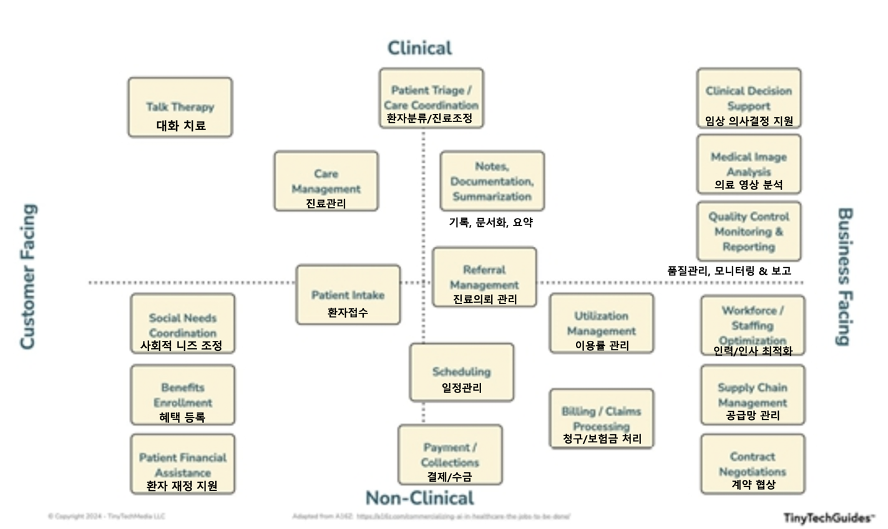

# 생성형 AI의 산업분야별 활용

## 목차
- [생성형 AI의 산업분야별 활용](#생성형-ai의-산업분야별-활용)
  - [목차](#목차)
  - [1 은행 및 금융](#1-은행-및-금융)
    - [활용방안 요약](#활용방안-요약)
    - [주요 사례연구](#주요-사례연구)
      - [골드만 삭스 (Goldman Sachs)](#골드만-삭스-goldman-sachs)
      - [도이치뱅크 (Deutsche Bank)](#도이치뱅크-deutsche-bank)
      - [모건스탠리 (Morgan Stanley)](#모건스탠리-morgan-stanley)
      - [블룸버그 (Bloomberg)](#블룸버그-bloomberg)
  - [2 에너지 및 유틸리티](#2-에너지-및-유틸리티)
    - [활용방안 요약](#활용방안-요약-1)
    - [주요 사례연구](#주요-사례연구-1)
      - [Octopus Energy (영국)](#octopus-energy-영국)
      - [Gridmatic \& EdgeConneX (미국)](#gridmatic--edgeconnex-미국)
      - [Exelon (미국)](#exelon-미국)
  - [3 정부 및 공공 부문](#3-정부-및-공공-부문)
    - [활용방안 요약](#활용방안-요약-2)
    - [주요 사례연구](#주요-사례연구-2)
      - [싱가포르 정부](#싱가포르-정부)
      - [아르헨티나 부에노스아이레스](#아르헨티나-부에노스아이레스)
      - [미국 재향군인회](#미국-재향군인회)
  - [4 헬스케어](#4-헬스케어)
    - [활용방안 요약](#활용방안-요약-3)
    - [주요 사례연구](#주요-사례연구-3)
      - [All Hands and Hearts + Wysa](#all-hands-and-hearts--wysa)
      - [Nebraska Medicine + Nuance](#nebraska-medicine--nuance)
      - [Janssen Pharmaceutical + Syntegra](#janssen-pharmaceutical--syntegra)
  - [5 보험](#5-보험)
    - [활용방안 요약](#활용방안-요약-4)
    - [주요 사례연구](#주요-사례연구-4)
      - [Nsure (미국)](#nsure-미국)
      - [Zurich (스위스)](#zurich-스위스)
      - [Allstate](#allstate)
  - [6 법률](#6-법률)
    - [활용방안 요약](#활용방안-요약-5)
    - [주요 사례연구](#주요-사례연구-5)
      - [LexisNexis](#lexisnexis)
      - [Freshfields Bruckhaus Deringer](#freshfields-bruckhaus-deringer)
      - [Orangetheory](#orangetheory)
  - [7 생명과학](#7-생명과학)
    - [활용방안 요약](#활용방안-요약-6)
    - [주요 사례연구](#주요-사례연구-6)
      - [Insilico Medicine](#insilico-medicine)
      - [ProGen \& OpenBioML](#progen--openbioml)
      - [UT Health San Antonio + University of Pittsburgh](#ut-health-san-antonio--university-of-pittsburgh)
  - [8 제조](#8-제조)
    - [활용방안 요약](#활용방안-요약-7)
    - [주요 사례연구](#주요-사례연구-7)
      - [Climax Foods (비건 치즈 제조)](#climax-foods-비건-치즈-제조)
      - [Nvidia ChipNeMo](#nvidia-chipnemo)
      - [GE Appliances](#ge-appliances)
      - [Merck](#merck)
      - [Sereact PickGPT](#sereact-pickgpt)
  - [9 미디어 및 엔터테인먼트](#9-미디어-및-엔터테인먼트)
    - [활용방안 요약](#활용방안-요약-8)
    - [주요 사례연구](#주요-사례연구-8)
      - [할리우드 - Metaphysic](#할리우드---metaphysic)
      - [Ayzenberg 게임 커뮤니티 AI 분석](#ayzenberg-게임-커뮤니티-ai-분석)
      - [게임산업의 생성형 AI 혁신](#게임산업의-생성형-ai-혁신)
  - [10 소매업](#10-소매업)
    - [활용방안 요약](#활용방안-요약-9)
    - [주요 사례연구](#주요-사례연구-9)
      - [Wendy's (미국 패스트푸드)](#wendys-미국-패스트푸드)
      - [Estée Lauder](#estée-lauder)
      - [Stitch Fix](#stitch-fix)
      - [코카콜라](#코카콜라)
  - [11 통신](#11-통신)
    - [활용방안 요약](#활용방안-요약-10)
    - [주요 사례연구](#주요-사례연구-10)
    - [Vodafone](#vodafone)
      - [EnterpriseWeb + KX + Microsoft](#enterpriseweb--kx--microsoft)
      - [SK텔레콤 "A." 챗봇](#sk텔레콤-a-챗봇)
  - [12 운송 및 물류](#12-운송-및-물류)
    - [활용방안 요약](#활용방안-요약-11)
    - [주요 사례연구](#주요-사례연구-11)
      - [Walmart AI 공급망 협상 자동화](#walmart-ai-공급망-협상-자동화)
      - [Siemens 공급망 AI 활용사례](#siemens-공급망-ai-활용사례)
      - [Unilever 공급망 지속가능성 AI 활용사례](#unilever-공급망-지속가능성-ai-활용사례)
  - [참고문헌:](#참고문헌)

---

## 1 은행 및 금융

### 활용방안 요약

| 활용방안 | 설명 | 기대 효과 |
|---------|------------------|-----------|
| **재무 보고서 작성 및 분석** | 계약서, 규제 신고서, 재무제표, 경제 데이터 분석 | 운영 효율성 증대, 전략적 책임 집중 |
| **개선된 고객 서비스 챗봇 및 가상 비서** | 24/7 AI 챗봇, 신용카드 사기 탐지와 같은 비표준 작업 완료 지원 | 고객 만족도 향상, 사기 피해 감소 |
| **자본시장 연구 및 보고서 생성** | 재무제표, 실적 발표 기록, 컨센서스(실적 전망 예상치) 추정치 신속 분석 | 보고서 작성 시간 단축, 분석 품질 향상 |
| **규제 변경 분석** | 규정 변경사항 분석하여 요약, 변경할 문서 추천, 교육 자료 수정 | 규정 준수 강화, 교육 효율성 증대 |
| **맞춤형 재무 분석** | 개인 위험 프로필 기반 투자 추천, 초개인화된 마케팅 | 고객 맞춤 서비스 확대, 매출 증대 |

### 주요 사례연구

#### 골드만 삭스 (Goldman Sachs)
- **목표**: 소프트웨어 개발 가속화
- **활용 방법**:
  - 반복적인 코딩 자동화
  - 디버깅과 리팩터링 지원
  - 관련 API 빠른 검색 및 사용
- **성과**: 코드의 최대 40% 생성, 개발자 생산성 대폭 향상
- **특징**: 개발자 대체가 아닌 생산성 향상이 목적

#### 도이치뱅크 (Deutsche Bank)
- **규모**: 25개 이상의 생성형 AI 파일럿 프로그램 운영
- **주요 기능**:
  - 실시간 언어 전환 가능한 고급 챗봇
  - 잠재 고객 발굴용 대시보드
  - 코드 생성
- **계획**: 2024년 AI 인력 2-3배 확대, 대부분 파일럿 출시 예정
- **도전과제**: 규제 프레임워크 불확실성, AI 인재 확보 경쟁

#### 모건스탠리 (Morgan Stanley)
- **솔루션**: AI @ Morgan Stanley Assistant
- **데이터베이스**: 약 100,000개의 연구 보고서와 문서 활용
- **기능**:
  - 시장, 추천상품, 내부 프로세스 관련 질문 신속 응답
  - 자연어 질문 방식 채택 (키워드 검색 대신 완전한 문장)
  - 재무 상담사 업무 효율성 향상
- **향후 계획**: Debrief 도구 파일럿 (고객 미팅 내용 자동 요약 및 후속 이메일 생성)

#### 블룸버그 (Bloomberg)
- **모델**: 자체 개발 LLM인 BloombergGPT 개발 (500억 파라미터)
- **학습 데이터**: 7,000억 토큰 (금융 문서 3,630억 + 일반 문서 3,450억)
- **주요 기능**:
  - 감성 분석 (62.47점)
  - 자연어 처리 기술로 문서에서 기업명, 인물, 금융상품, 금액, 날짜 등 자동 추출/분류
  - 뉴스 분류
  - 질의응답
- **성능**: 유사 규모 오픈 모델 대비 금융 태스크에서 우수, 일반 목적 태스크에서도 경쟁력 유지

| [Top](#목차) |

---

## 2 에너지 및 유틸리티

### 활용방안 요약

| 활용방안 | 설명 | 기대 효과 |
|---------|------------------|-------------|
| **개인화된 고객 서비스** | 사용량 데이터 기반 맞춤형 에너지 절약 추천, 개인화된 청구서 생성 | 고객 참여도 증대, 에너지 효율성 향상 |
| **재생 에너지 최적화** | 날씨 데이터 분석을 통한 태양광/풍력 발전량 예측, 그리드 운영 최적화 | 간헐적 재생 에너지원의 효율적 통합 |
| **인프라 검사 자동화** | 드론 영상 기반 전력망 시설 결함 탐지, 합성 이미지 데이터를 통한 AI 모델 훈련 | 현장 위험 노출 감소, 신뢰성 향상 |
| **예측 유지보수** | 장비 가동시간 최적화, 원격측정 데이터 지속 모니터링 | 계획되지 않은 중단 방지, 비용 절감 |

> 그리드란? 전봇대, 전선, 변압기 등 전기 전달 공급망을 의미 

### 주요 사례연구

#### Octopus Energy (영국)
- **솔루션**: AI 챗봇 Sam
- **기능**: 청구, 결제, 계정 관리에 대한 일반적인 질문 답변, 24/7 자동화된 지원
- **성과**:
  - 1개 AI가 250명 상담원이 하는 고객 이메일 응대 수행
  - 고객 만족도 80% 달성 (인간 상담원 65% 대비)
- **특징**: 업무 대체가 아닌 보완 목적으로 활용, 인력 감축 계획 없음

#### Gridmatic & EdgeConneX (미국)
- **프로젝트**: 24/7 무탄소 에너지(CFE:Carbon Free Energy) 전략 시범 도입
- **기능**: 
  - 예측/분석: 전력 수요, 재생에너지 출력, 에너지 가격/변동성 예측 + 고객 사용 패턴 분석
  - 최적화: 전력망 관리, 에너지 저장 시스템 운영, 부하 균형 조정, 혼잡관리 
- **성과**: 텍사스 데이터센터에 지속적인 CFE 제공 실현
  - 7개 ISO에서 실시간/하루전 시장 거래 알고리즘 운영(2017~)
  - ERCOT 시장에서 저장시스템 수익 28% 향상

#### Exelon (미국)
- **과제**: 1,000만 이상 고객을 위한 그리드 신뢰성 보장
- **솔루션**: NVIDIA Omniverse를 활용한 합성 이미지 데이터 생성
- **프로세스**:
  - 그리드 인프라 자산 결함을 사실적으로 묘사한 합성 이미지 생성
  - 실시간 드론 검사용 컴퓨터 비전 모델 훈련
- **성과**: 드론 검사 자동화로 현장 위험 노출 감소, 전력망 신뢰성 향상

| [Top](#목차) |

---

## 3 정부 및 공공 부문

### 활용방안 요약

| 활용방안                    | 설명 | 기대 효과                          |
|----------------------------|----------------------|------------|
| 24시간 온라인 가상챗봇 지원   | AI 챗봇이 고객 문의에 대해 연중무휴 신속 자동 응답                  | 고객 만족도 및 응대 속도 향상, 인건비 절감   |
| 부정행위 탐지               | 비정상적 패턴·이상행동을 AI가 자동 분석 감지                        | 보안 사고 예방, 신속 조치           |
| 규제 준수 간소화            | 최신 규제·지침 반영을 AI가 자동 점검·보고 지원                      | 법적 리스크 감소, 컴플라이언스 비용 절감 |
| 일상적인 사무관리 자동화     | 반복 업무(메일·보고·자료정리 등)를 AI가 대신 처리                   | 직원 업무 효율·생산성 향상           |
| 사이버보안 위협 감지         | 실시간 로그 분석·이상 활동 감지로 보안 공격 조기 파악                | 보안 사고 최소화, 대응 시간 단축      |
| 직원 맞춤형 교육·훈련        | 직원별 역량/이력 진단, 개인화된 AI 교육 콘텐츠 제공                 | 교육 효과 극대화, 직원 역량 강화      |
| 예측 정비, 환경 모니터링, 물류·재무관리   | AI로 센서 데이터 분석, 예측 유지보수, 환경·물류·재무정보 등 관리 최적화 | 유지보수 비용 절감, 업무 의사결정 개선   |

### 주요 사례연구

#### 싱가포르 정부
- **솔루션**: 생성형 AI "co-pilot" 도입
- **기능**:
  - 법규와 내부 자료 검색을 통한 신속한 답변 제공
  - 새로운 정책 제안 생성 지원
  - 회의록 요약, 공문서 작성 간소화
- **효과**: 직원들의 필요한 데이터 신속 검색, 정책 개발 프로세스 개선

#### 아르헨티나 부에노스아이레스
- **솔루션**: Boti 챗봇 개발
- **플랫폼**: WhatsApp 기반 시민 소통
- **기능**: 문화와 관광 정보 제공
- **확장성**: 다양한 시 서비스로 확장 가능

#### 미국 재향군인회
- **프로젝트**: AI 심장수술 코치 개발
- **목적**: 수술진들의 생각하는 방식이나 이해가 다름을 포착하여 치명적 실수 예방
- **기능**:
  - 실시간 수술팀 모니터링
  - 수술진들의 행동과 의사소통 분석
  - 이해 차이, 의사소통 불일치, 잠재적 혼란 가능성 감지
- **혁신성**: AI가 단순 작업 자동화를 넘어 복잡한 인간 협업까지 지원

| [Top](#목차) |

---

## 4 헬스케어

### 활용방안 요약

| 활용방안 | 설명 | 기대 효과 |
|---------|------------------|-----------|
| **의료 기록 자동화** | 의사-환자 대화 자동 기록, EHR 문서화, 메모 작성 자동화 | 문서화 부담 50% 감소, 환자 중심 진료 |
| **합성 데이터 생성** | 연구용 환자 데이터 합성 생성, EU 개인정보보호법 준수 | R&D 가속화 (6개월→1개월) |
| **정신건강 지원** | 24/7 AI 챗봇을 통한 감정 지원, 자가 도움 기능 제공 | 스트레스 70% 감소, 접근성 향상 |
| **수술 계획 및 교육** | 실제와 같은 3D 모델 생성, 개인화된 환자 반응 시뮬레이션 | 수술 정확도 향상, 교육 효과 증대 |

> EHR이란? 전자건강기록(Electronic Health Record)    
  
헬스케어 AI 활용 분야:   

### 주요 사례연구

#### All Hands and Hearts + Wysa
- **배경**: 자연재해 구호활동 중 일선 근로자들의 심리적 어려움
  - 극심한 스트레스, 심각한 피로, 번아웃, 정신건강 악화
- **솔루션**: Wysa 24/7 - 자가 도움 및 감정 지원 챗봇
- **기능**:
  - 스트레스 관리 기법 제공
  - 감정 상태 모니터링
  - 명상/호흡 가이드
  - 긍정적 사고방식 코칭
  - 수면관리 지원
  - 필요 시 전문가 연계
- **특징**: 익명성, 즉각적 응답
- **성과**: 직원의 25% 사용, 스트레스 수준 70% 감소
- **혁신성**: AI가 인간의 정신건강과 웰빙을 효과적으로 지원할 수 있음을 입증 

#### Nebraska Medicine + Nuance
- **과제**: 의사와 의료 제공자들의 방대한 서류 작업
- **솔루션**: Nuance Dragon Ambient eXperience (DAX)
- **기능**:
  - 의사와 환자간 대화를 자동으로 문서화
  - 대화형 AI, 주변 감지 기술
  - 딥러닝 기반 자동 임상 문서화
  - EHR 시스템과 연동
- **성과**:
  - 문서화 부담 50% 감소
  - 환자 한 명당 약 7분 시간 절약
  - 의사 만족도 88% 향상

#### Janssen Pharmaceutical + Syntegra
- **과제**: EU 개인정보보호법 제약 하에서 R&D 가속화
- **솔루션**: 합성 데이터 활용
- **특징**: "인위적으로 만들어진" 데이터로 EU 개인정보보호법 적용 받지 않음
- **성과**: 연구 질문 답변 시간 6개월→1개월 단축

| [Top](#목차) |

---

## 5 보험

### 활용방안 요약

| 활용방안 | 설명 | 기대 효과 |
|---------|------------------|-----------|
| **고객 이메일 자동 분류** | 고객 문의 자동 분류 및 요약, 자동 응답 생성 | 비용 60% 절감, 처리 속도 향상 |
| **인수심사 자동화** | 신청자 정보 분석을 통한 신속한 견적 및 심사 결정 | 처리 시간 단축, 정확도 향상 |
| **보험금 청구 처리** | 사진, 영상, 문서 분석을 통한 손해 평가 및 합의 제안 | 처리 효율성 증대, 고객 만족도 향상 |
| **교육 자료 개발/RFP준비** | 최신 규정이 포함된 교육 자료 자동 개발, 제안요청서 준비 | 규정 준수 강화, 업무 효율성 증대 |

### 주요 사례연구

#### Nsure (미국)
- **규모**: 50개 이상 제공업체와 연계, 100만 사용자
- **솔루션**: Microsoft Power Platform + AI
- **기능**:
  - 이메일/메시지 자동 분류 및 라우팅: 우선순위 평가, 내용 요약, 부서별 배분
  - 비정형 데이터 추출/변환: 여러 문서에 분산된 보험 정책 통합, 문서 핵심 정보 추출, 이메일/문서의 예약 시간 추출하여 일정시스템에 등록  
- **성과**: 수동 작업 60% 감소, 운영 비용 50% 절감, 고객 만족도 4.7/5.0 달성

#### Zurich (스위스)
- **데이터**: 최근 6년간의 청구 데이터 분석
- **목표**: 인수심사(언더라이팅) 프로세스 개선
- **기능**:
  - 보험금 청구 설명 및 문서에서 데이터 추출
  - 광범위한 청구에 걸친 손실의 근본 원인 식별
  - 통계 모델을 위한 코드 작성
  - 위험 검사 자동화
  
- **특징**: 
  - 사람 대체가 아닌 보조 도구로 활용
  - 마이크로 표정 인식 등 침습적 기술(사생활 과도 침해 기술) 배제

#### Allstate
- **솔루션**: MyStory (ChatGPT 기반)
- **과제 해결**: 고객이 여러 담당자에게 반복 설명하는 불편함
- **기능**:
  - 정보수집
    - 고객이 한 번만 사고 내용 설명
    - ChatGPT가 대화 형식으로 정보 수집
  - 문서화
    - 수집된 정보 자동 정리 및 표준화된 형식으로 변환
    - 핵심 내용 요약
  - 정보공유
    - 관련 부서에 자동 배포
    - 실시간 정보 업데이트
- **성과**: 보험금 청구 보고 시간 대폭 단축, 고객 스트레스 감소

| [Top](#목차) |

---

## 6 법률

### 활용방안 요약

| 활용방안 | 설명 | 기대 효과 |
|---------|------------------|-----------|
| **전자증거개시** | 대량 디지털 증거 검색, 분류, 분석 자동화 | 법률팀 대비 훨씬 짧은 시간에 100% 문서 분석 |
| **계약서 검토** | 다국어 계약서 분석 및 법적 위험 요소 식별 | 20-40% 효율성 향상 |
| **법률 연구 및 문서 작성** | 판례 요약, 법률 문서 초안 작성, 대화형 검색 | 변호사 시간 6-8시간→1시간 미만 단축 |
| **규정 준수 모니터링** | 위험 평가 및 관리, 커뮤니케이션 검토 | 규정 준수 보장, 리스크 완화 |

### 주요 사례연구

#### LexisNexis
- **솔루션**: Lexis+ 
- **기능**:
  - 대화형 검색, 스마트 법률 문서 작성
  - 신속한 판례 요약
  - 문서 초안 자동 생성
  - 이메일 작성 보조
  - 맞춤형 언어와 톤 앤 매너 조정
- **기술적 특징**:
  - LexisNexis 법률 콘텐츠로 훈련
  - 환각 현상 제거: 외부 인용 배제, 법률 인용문 연동
  - 멀티 LLM 전략 (GPT-4, Claude): 질문 유형별 최적 모델 자동 선택 
- **안전장치**: 
  - 사전 설정된 프롬프트 제공
  - 부정확한 응답 시 추가정보 요청
  - 내부 콘텐츠로 한정된 응답

#### Freshfields Bruckhaus Deringer
- **프로젝트**: 새로운 독일 반부패법 시행에 따른 기존 계약서 분석하여 리스크 식별 
- **규모**: 독일어와 스페인어로 된 11,500개 이상의 계약서
- **솔루션**: Litera 소프트웨어 (Kira AI) 활용
- **기능**:
  - Quick Study 기계학습으로 독일어 조항 자동 인식
  - 계약 유형 분류, 위험 조항 식별
  - 다국어 지원 (독일어 5,000+ 문서, 스페인어 800+ 문서)
- **성과**: 20-40% 효율성 향상

#### Orangetheory
- **과제**: 24개국 1,500개 스튜디오, 1,000개 서로 다른 계약 템플릿 표준화
- **솔루션**: Ironclad AI Assist
- **기능**:
  - 자동 문서 비교/수정
  - Smart Import (검색 가능 형식 변환)
  - Clickwrap (전자 서명)
- **성과**: 
  - 계약 시간 50% 단축, 80% 정확도 달성
  - 프랜차이즈 협업 간소화: 공용 워크플로우 도입, 원클릭 서명 시스템, 자동 확인 프로세스  

| [Top](#목차) |

---

## 7 생명과학

### 활용방안 요약

| 활용방안 | 설명 | 기대 효과 |
|---------|------------------|---------------|
| **신약 발견** | Chemical Language Models, 신약 후보 물질 식별, 화학 화합물 시뮬레이션 | 개발 비용 90% 절감, 시간 66% 단축 |
| **단백질 및 DNA 서열 생성** | 텍스트 프롬프트로부터 단백질/DNA 서열 생성, 기능 예측 | 2개월 내 수백 개 신규 분자 생성 |
| **의료 이미지 개선** | CT/CBCT 스캔 통합, 종양 수축 측정 정확도 개선 | 방사선 폐렴 및 폐 손상 35% 감소 |
| **임상시험 최적화** | 맞춤의학을 위한 임상시험, 단백질 구조 예측 | 시장 출시 시간 단축, 성공률 향상 |

### 주요 사례연구

#### Insilico Medicine
- **플랫폼**: Pharma.AI
  - PandaOmics: 질병 타겟 단백질 식별 (수백만 데이터 학습)
  - Chemistry42: 신약 후보물질 설계 (NVIDIA GPU 활용)
- **프로세스**: 80개 분자 설계/합성, 18개월 내 후보물질 선정
- **성과**: 폐섬유증 치료제 2상 진입, 2.5년 내 임상 1상 도달, 기존 대비 비용 90%/시간 66% 단축
- **향후**: 30+ 신약개발 파이프라인, 항암제 등 적용 확대

#### ProGen & OpenBioML
- **ProGen**: 2.8억 시퀀스 학습으로 기능 예측 가능한 단백질 시퀀스 생성
- **OpenBioML**:
  - BioLM: 자연어 처리 기반 생물학적 연관성 높은 화합물 발굴
  - DNA-Diffusion: DNA 시퀀스 생성
- **시장 전망**: 2022년 투자액 13.7억 달러, 2040년 의료산업 가치 1조 달러 예상

#### UT Health San Antonio + University of Pittsburgh
- **목적**: 폐암 환자의 종양 수축 측정 정확도 개선
- **기술**: AI를 사용한 CT/CBCT 스캔 통합 분석
- **성과**:
  - 16명 폐암 환자 대상 6주간 추적
  - 방사선으로 인한 폐렴 및 폐 손상 35% 감소
  - 연간 200만 암환자 혜택 기대

| [Top](#목차) |

---

## 8 제조

### 활용방안 요약

요약표 예시

| 활용방안          |설명  | 기대 효과                        |
|-------------------|------|---------------------------------|
| 고객 서비스        | AI 가상 어시스턴트로 판매 후 지원, 일정 관리, 고객 문의·문제 해결 등 자동화           | 고객 만족도/응대 속도 향상, 업무 효율화 |
| 결함 탐지         | 생산 라인·센서·영상 등에서 이상 징후 자동 감지 및 빠른 결함 판별                     | 불량률 감소, 조기 문제 예방          |
| 이벤트 모니터링    | 장비 가동시간·상태를 원격 데이터로 실시간 확인·분석                                 | 설비 효율 최적화, 다운타임 최소화     |
| 제품 개발         | 시장·고객 데이터 등 다양한 비정형 정보 활용해 신제품·서비스 기획                      | 혁신 가속화, 수요 반영 신제품 개발     |
| 제품 매뉴얼 업데이트 | 기존 매뉴얼, 설계 자료, 고객문의 분석해 FAQ 및 서비스 문서 최신화                      | 사용자 편의 증대, 지원 최소화         |
| 마케팅 및 영업     | 재고·판매이력·프로모션 등 데이터로 맞춤 추천 등 마케팅 지원                            | 매출 증대, 마케팅 효율 향상           |
| 공급망 관리       | 공급망 문서 분석해 공급업체 추천, 위험 발생 시 대응방안 제시                           | 리스크 관리, 공급망 안정화            |
| 가상 어시스턴트   | 장비 조작, 문제 해결, 표준절차 안내, 교육까지 지원하는 AI 비서 제공                    | 직원 교육·지원 강화, 오류 예방         |

### 주요 사례연구

#### Climax Foods (비건 치즈 제조)
- **목표**: 수천 가지 재료 조합과 단백질 조사로 완벽한 레시피 개발
- **AI 활용**: 
  - 데이터 수집/분석: 다양한 기계(이온 크로마토그래피, 질량 분석기, 점도 측정기)의 실험 데이터를 자동으로 수집/분석하여 결과 제공 
  - 프로토타입 개발: 5,000+ 치즈 시제품, 10만+ 원료 조합, 50개 분석 지표를 비교/분석하여 어떤 조합이 가장 좋은지 찾도록 지원
- **성과**: 식물성 치즈 개발 - 브리/페타/블루치즈 등 동물성과 유사한 맛/질감 구현
- **의의**: 치즈 생산 탄소발자국 절감, 연간 2,200만톤 소비량 대체 가능성

#### Nvidia ChipNeMo
- **모델**: 43B 파라미터, 1조+ 토큰 학습
- **기능**: 
  - 기술문서 검색 챗봇
  - 칩 설계 코드 생성기
  - 버그 분석 도구
- **의의**: 전문분야 AI 활용 선례, 오픈소스 프레임워크 공개

#### GE Appliances
- **Flavorly AI 앱**: 주방 재료 기반 맞춤형 레시피 추천
  - 보유 재료 기반 레시피 추천
  - 식단 선호도 반영: 선호하는 맛, 종류, 재료 등
  - 요리 종류 선택: 한식, 이탈리안, 프랑스 등
  - 식이 제한 고려: 건강, 알레르기, 종교 등으로 인한 제한된 음식이나 재료 
- **SmartHQ Assistant**: 가전제품 관리 지원
  - 사용설명서 검색
  - 필터 교체 안내
  - 청소 팀 제공
  - 실시간 질의/응답 
- **기술**: Google Cloud Vertex AI 플랫폼 활용
- **특징**: 비소유자도 사용 가능한 앱 범용성 확대

#### Merck

- **배경 및 목표:**  
  글로벌 제약사 Merck는 의약품 불량률 감소, 출시 시간 단축, 제품 안전성 및 품질관리 강화를 위해 AWS 클라우드와 AI를 도입함.

- **주요 활용 기술:**  
  실시간 데이터 수집·분석을 위해 AWS Glue, Kinesis, Redshift, QuickSight, SageMaker 등 다양한 AWS 서비스와 AI/ML 플랫폼을 통합하여 운영.

- **AI 활용 방식:**  
  실제 결함 데이터가 부족한 문제를 해결하기 위해 생성형 AI(GAN, VAE)를 적용, 합성 결함 이미지를 만들어 AI 불량 검출 모델을 학습시킴.

- **혁신적 프로세스:**  
  - 제조·검사 기계에서 실시간 데이터 자동 수집  
  - 데이터 정제 및 문맥화, 대시보드 분석 구축  
  - 불량품 자동 탐지 및 개선 조치 자동화

- **성과 및 효과:**  
  - 불량품 조사 시간·비용 절감  
  - 제조 효율 및 품질관리 대폭 향상  
  - 의사결정에 데이터 기반 인사이트 활용  
  - 전체 생산 리드타임(출시까지 소요 시간) 단축

#### Sereact PickGPT  
- **PickGPT란?**  
  - Sereact(독일 AI 로봇 벤처)가 개발한 자연어 기반 로봇 제어 시스템
  - 대형 언어모델(LLM)과 컴퓨터 비전을 결합하여 사람의 자연어(음성·글자) 지시를 로봇이 바로 이해하고 실행하도록 만든 기술

- **핵심 기술 및 특징**  
  - 자연어 명령 처리, 실시간 객체 인식(Multi-Modal)  
  - 코딩 필요 없이 직관적인 인터페이스로 동작  
  - 음성 명령과 다양한 작업 환경 적응  
  - 자동 제품 매칭 및 환경 인식 지원

- **주요 활용**  
  - 물류·창고에서 피킹 포인트 지정, 제품 분류/정렬  
  - 품질 관리(불량품 판별 등)  
  - 반품 처리(포장재 구분, 바코드 없는 상품 분류 등) 자동화

| [Top](#목차) |

---

## 9 미디어 및 엔터테인먼트

### 활용방안 요약

| 활용방안        | 설명   | 기대 효과                        |
|-----------------|---------|------|
| 광고 최적화      | 끊임없는 A/B 테스트로 광고·캠페인 성과를 지속 개선  | 광고 효율 증대, 예산 절감  |
| 잠재고객 세분화   | 행동·속성 데이터 분석을 통한 세밀한 타겟 고객 분류 | 맞춤형 마케팅, 전환율 향상|
| 자동 제작        | AI로 사진, 영상, 애니메이션, 음성 등 멀티미디어 콘텐츠를 빠르게 자동 생성            | 제작 시간·비용 절감, 다양성 확장    |
| 댓글 관리  | 댓글 및 사용자 생성 콘텐츠 자동 검토·정책별 조정 | 브랜드 보호, 위험 요소 최소화      |
| 경쟁사 벤치마킹   | 경쟁사 콘텐츠 성과·전략 자동 분석 및 비교 | 효과적인 콘텐츠 전략 수립          |
| 개인화 콘텐츠 추천   | 탐색 이력·행동·유사 사용자 기반 개인화 추천 제공  | 사용자 경험·몰입도 향상 |
| 미디어 모니터링   | 다양한 미디어를 스캔해 자사 관련 언급·이슈 실시간 파악                            | 위기 대응력 강화, 평판 관리         |
| 맞춤형 콘텐츠     | 사용자관심 맞춤 기사·영상·음악 등 여러 유형 콘텐츠 자동 제작                      | 충성도·방문 증대, 이탈률 감소       |
| 트렌드 예측      | 소비자 데이터·신호 분석으로 신규 트렌드·관심사 미리 포착, 미래 콘텐츠 전략 제안      | 선제적 대응, 경쟁력 강화 |

### 주요 사례연구

#### 할리우드 - Metaphysic
- **프로젝트**: 배우의 "디지털 트윈" 제작
- **기능**: 
  - 배우별 AI 모델 구축
  - 연령대별 모델 학습
  - 실시간 영상 처리
- **성과**: 
  - 비용 80% 절감
  - DeepTomCruise 바이럴 영상 수억뷰 달성
  - 영화 'Here': 최초의 AI 중심 할리우드 영화 (Tom Hanks 주연)

#### Ayzenberg 게임 커뮤니티 AI 분석
- **프로젝트 개요**  
  Ayzenberg(게임광고 에이전시)은 Glimpse AI와 함께 여성, 흑인/원주민/유색인종, 성소수자 게이머의 커뮤니티 경험을 생성형 AI로 분석하여 유해 행위와 커뮤니티 문제를 진단함.

- **주요 분석**  
  - 모욕·비하, 조직적 괴롭힘 등 유해 행위 유형/패턴 자동 추출  
  - 500건 이상의 자유 응답 텍스트로부터 긍정·부정 경험, 대응 전략 아이디어 수집

- **AI 활용 방식**  
  - 개방형 답변 데이터 대규모 자동 분석  
  - 긍·부정 스토리 생성 및 실행 가능한 인사이트 도출

- **성과 및 가치**  
  - 유해 환경이 게이머 이탈 및 수익 손실에 직접적 영향을 미침을 입증  
  - 커뮤니티 포용성 강화 전략 및 실질적 대응책 도출  
  - 다양한 게임·디지털 커뮤니티 및 일반 주제에도 AI 분석 적용 가능

- **핵심:**  
  생성형 AI 기반 텍스트 분석으로, 게임 내 사회적 소수 집단의 경험을 대규모로 빠르게 파악하고  
  포용적 커뮤니티 조성을 위한 실질적 전략 수립 및 실행에 활용됨.

#### 게임산업의 생성형 AI 혁신

- **핵심 변화**  
  - 게임 콘텐츠 제작 비용과 시간이 획기적으로 축소(3주 → 1시간 등)
  - 진입장벽이 크게 낮아짐
  - 실시간·무한 변형 콘텐츠 제작이 가능해짐

- **AI 활용 분야**  
  - 2D/3D 아트(컨셉, 프로덕션, 텍스처, 애니메이션)  
  - 레벨·월드(맵) 디자인  
  - 오디오, 음악, NPC/캐릭터 생성  
  - 예시: 마이크로소프트는 AI로 2D 위성 이미지로부터 실감나는 3D 세계를 자동 구축함

- **산업 영향**  
  - 소수 인력의 마이크로 스튜디오 증가  
  - 완전히 새로운 게임 장르, 개인화 게임 경험 확산  
  - 저작권 등 법적 이슈 대두

- **향후 전망**  
  - AI 활용 역량 갖춘 전문가 수요 증가  
  - 게임 개발의 황금기 도래, 산업별 특화 AI 도구 가치 증가  
  - 코드 프로그래밍 영향력은 제한적

| [Top](#목차) |

---

## 10 소매업

### 활용방안 요약

| 활용방안             | 설명      | 기대 효과        |
|----------------------|------------|------------------------------|
| 크리에이티브 개발     | 디자인, 이미지, 영상 등 시제품 제작 자동화              | 제작 속도 향상, 비용 절감     |
| 고객 서비스/지원     | 챗봇·AI 어시스턴트로 문의 응대, 문서·FAQ 자동 생성       | 만족도 증대, 운영 효율화      |
| 마케팅 개인화        | 메시지·콘텐츠 대량 맞춤화, 템플릿 생성                  | 전환율 증가, 충성도 강화      |
| 제품 상세 설명       | 상품 설명문·이미지 대량 자동 작성                       | 상품 정보 갱신/출시 가속화   |
| 제품 리뷰 분석       | 리뷰 신속 분석·요약, 가짜 감지, 소비자 인사이트 제공     | 의사결정 지원, 품질 개선      |
| 제품 개발           | 시제품 신속 제작, 반복 테스트·개선                       | 혁신 가속화, 제품 경쟁력 증대 |
| 공급망/물류         | 계약 조건 협상, 맞춤 배송·사후관리 자동화                | 원가 절감, 공급망 최적화      |
| 가상 어시스턴트/스타일리스트 | 맞춤 챗봇/추천, 스타일링 안내                         | 고객 경험·상담 품질 향상      |

### 주요 사례연구

#### Wendy's (미국 패스트푸드)
- **목적**: 드라이브스루 주문 프로세스 자동화 (고객의 75-80% 이용)
- **솔루션**: Wendy's FreshAI 봇
  - 주문한 음식을 주방에서 지하 통로를 통해 고객의 주차 공간으로 수초내에 배달
  - 완전 자율 지하 로봇 이용
- **효과**: 주문 프로세스 간소화, 주문 품질 개선, 고객 경험 향상

#### Estée Lauder
실시간 감성 분석, 맞춤형 제품 추천, 데이터 기반 마케팅 전략 등  
고객 중심 경험과 비즈니스 혁신 선도

- **소비자 감성 분석**
  - PaLM 2 언어모델을 활용해 SNS, 고객상담, 브랜드 사이트, 리뷰 등 다양한 채널의 소비자 의견을 자동 분석
  - Vertex AI로 실시간 모니터링, 소비자 우려나 트렌드를 빠르게 파악해 고객 경험을 개선

- **맞춤형 추천 및 개인화**
  - Google Cloud Retail Search로 고객의 구매 의도를 이해하고 맞춤 검색 결과 제공
  - Recommendations AI로 각 고객에게 개인화된 제품 추천, 교차 판매 기회 탐색, 고객 생애 가치 극대화

- **통합 데이터 분석**
  - BigQuery와 Looker로 20개 브랜드, 40여 개국에서 수집한 마케팅/세일즈/운영 데이터를 통합 분석
  - 다양한 지역별 소비자 행동과 특성을 식별, 기업의 마케팅 및 영업 전략에 활용

#### Stitch Fix 
AI 기반 OCM·생성형 모델을 통해 대규모 패션 데이터에서  
각 고객 최적의 스타일링, 광고, 제품 설명을 실시간으로 제공
- **생성형 AI 광고 및 제품 설명**  
  - 스타일 키워드를 입력해 자동으로 온라인 광고 문구 생성  
  - GPT-3로 30분마다 1만 개의 신상품 설명 자동 작성, 1분 만에 검토

- **Outfit Creation Model(OCM)**  
  - 스타일리스트가 만든 수백만 벌의 의상 조합 학습  
  - 의류 재고, 고객 선호도, 구매 내역을 실시간 반영해 4,300만+ 의상 조합 분석  
  - OCM이 중심 아이템을 기준으로 나머지 아이템을 실시간 추천(코디 자동 완성)

- **주요 효과**  
  - 최적화된 개인 맞춤형 옷차림 제안  
  - 고객 선호, 재고 상황, 최신 트렌드까지 반영한 동적 추천  
  - 신속하고 대규모의 콘텐츠 자동생성 및 품질 관리

#### 코카콜라 
AI를 활용한 크리에이티브 개방·팬 참여, 그리고 마케팅·업무 효율을 동반 추구
- **‘Create Real Magic’ 캠페인**
  - OpenAI(GPT-4, DALL-E)를 활용해 누구나 코카콜라 브랜드 자산(로고, 산타, 곰 등)으로 AI 아트를 제작할 수 있는 온라인 플랫폼 오픈
  - 팬·디지털 아티스트들의 창작물 중 우수 작품을 뉴욕·런던 대형 광고판에 노출, 본사 초청 크리에이티브 워크샵 개최

- **AI의 전사적 활용 확대**
  - 마케팅 콘텐츠 제작기간을 주 단위에서 일 단위로 단축
  - 향후 내부 지식 관리, 고객 서비스, 소매점 자료 제작 등 비즈니스 전반에 AI 적용 계획

| [Top](#목차) |

---

## 11 통신

### 활용방안 요약

| 활용방안              | 설명 | 기대 효과     |
|-----------------------|------------------|-------|
| 고객 서비스           | 콜센터 등에서 AI 상담원이 문의 응답, 결제 처리, 통화 요약 자동화 | 응대 품질·속도 향상, 업무 효율화 |
| 마케팅/판매           | 고객별 초개인화 문자·이미지 마케팅 콘텐츠 자동 생성, 최적 옵션 안내 | 마케팅 효율·고객 만족 증대     |
| 유지보수/재고 관리     | 기술자가 필요한 부품을 AI로 파악, 작업 단계별 지침 자동 제공    | 작업 실수 감소, 유지보수 신속화 |
| 자율 네트워크/최적화   | AI/ML이 네트워크 성능·용량 분석, 장애·품질 저하 예방·최적화    | 서비스 품질 강화, 안정성 향상   |

### 주요 사례연구

### Vodafone 
글로벌 다국어 고객 지원, 운영 효율화, 시장별 빠른 대응력을 강화
- **디지털 어시스턴트 TOBi 개발**  
  - Azure AI 기반 챗봇(TOBi)을 15개 언어, 글로벌 15개 시장에 서비스  
  - 요금 문의, 계약 갱신 등 고객지원 담당  
  - 자연어 처리, 실시간 AI 번역(Translator) 적용

- **고객 서비스 개선**  
  - 생성형 AI로 콜센터 문의 감소, 상담사 업무 효율화  
  - 익명화된 통화·대화 기록을 분석해 고객의 문의/불편 분석 및 서비스 품질 개선

- **생산성 및 운영 혁신**  
  - 가상 코드 어시스턴트로 개발팀 생산성 30~45% 향상  
  - 기존 학습모델 재활용으로 비용 절감, 출시 속도 가속화

- **확장성 및 현지화**  
  - 줄루어 등 현지어 포함 다양한 언어 지원 예정  
  - 월 2,500~3,000만 회 이상의 대화 처리, 향후 5억 회 기대

#### EnterpriseWeb + KX + Microsoft 
통신 네트워크 관리의 복잡성을 줄이고 자연어 중심의 스마트 자동화를 실현
- **프로젝트 개요**  
  - EnterpriseWeb, KX, Microsoft 3사가 통신사 전용 생성형 AI 프로토타입을 공동 개발
  - 고객·개발자는 자연어 대화(프롬프트)만으로 복잡한 통신 네트워크 서비스 오케스트레이션(설정·운영)이 가능

- **주요 기능·특징**  
  - "이 서비스 연결해줘"처럼 쉬운 명령으로 복잡한 네트워크 자동 설정
  - AI가 네트워크 서비스 신속·안전 배포, 실시간 문제 자동 해결 및 성능 최적화

- **기대 효과**  
  - IT·네트워크 관리 업무의 대폭적인 자동화, 효율성 향상
  - 관리 생산성 및 운영 안정성 증대

#### SK텔레콤 "A." 챗봇  
국내 최초로 인간적·감성적 상호작용이 가능한 AI 챗봇 서비스를 다양한 비즈니스 분야에 적용
- **AI 챗봇 "A." 개발**
  - 음악 스트리밍, 이커머스, 고객 서비스, 마케팅 등 다양한 서비스 통합
  - 2023년 정식 출시, 다국어 지원과 아바타 기반의 고유 캐릭터 보유

- **기술적 차별성**
  - ChatGPT, Microsoft Azure OpenAI 등 최첨단 LLM, 클라우드 활용
  - "Chat T" 및 "A. friends" 기능으로 더 인간적인 대화와 감성·상담 제공

- **특징**
  - 사용자가 만화 아바타 AI와 일상대화·상담·조언 가능(친구 같은 상호작용)
  - 클라우드 기반으로 다양한 서비스에서 신속하게 응대

| [Top](#목차) |

---

## 12 운송 및 물류

### 활용방안 요약

| 활용방안 | 설명 | 기대 효과 |
|---------|------------------|-----------|
| **경로 최적화** | 실시간 교통 데이터 분석, 최적 배송 경로 계산 | 배송 시간 단축, 연료 비용 절감 |
| **수요 예측** | 계절성, 이벤트 데이터 기반 물류 수요 예측 | 재고 최적화, 고객 서비스 향상 |
| **자율 운행** | 차량 간 통신, 환경 인식, 의사결정 지원 | 안전성 향상, 운영 효율성 증대 |

### 주요 사례연구

#### Walmart AI 공급망 협상 자동화
비용 절감·협상 자동화·공급망 관리 효율화 효과를 얻고,  
글로벌 대규모 기업의 공급업체 협상 한계를 혁신적으로 해결
- **도입 배경**  
  - Walmart는 수많은 공급업체(100,000+)와 비용·조건 협상에 인력 한계가 있어, Pactum AI 챗봇을 활용해 공급망 협상을 자동화함
  - 공급업체 68%가 실제로 AI 챗봇 협상에 참여

- **운영 방식**  
  - AI 챗봇이 정해진 시나리오에 따라 공급업체와 1:1로 대화하며 협상  
  - 공급업체는 언제든, 자신만의 속도·의견으로 협상에 참여 가능

- **성과**  
  - 파일럿: 89개 공급업체 중 64%와 협상 타결, 평균 11일 만에 협상 완료  
  - 평균 1.5~3% 비용 절감, 대금 지불 유예기간 연장 등 자금유동성 증대  
  - 2,000건 협상 동시 진행 가능, 글로벌(미국/칠레/남아공)로 확장  
  - 공급업체 83%가 “사용 쉽고, 대안제시 등 유연한 방식” 긍정 평가

#### Siemens 공급망 AI 활용사례
공급망 리스크와 신규 공급자 탐색을 효율·투명·자동으로 관리,  
글로벌 공급망의 신뢰성과 경쟁력을 크게 향상 시킴
- **도입 배경 및 목표**
  - 독일 법률상 환경/인권 리스크 모니터링 등 공급망 투명성 확보 필요
  - Scoutbee 생성형 AI를 도입해 공급업체의 리스크 탐지·관리 및 대체 공급자 탐색

- **주요 적용 내용**
  - 고품질 공급업체를 웹 데이터 기반으로 신속 탐색·발굴
  - 공급업체 정보요구(RFI) 절차, 설문, 비교·검증을 AI로 자동화
  - 공급업체와의 협상 전 과정을 플랫폼에 기록해 관리의 투명성 확보

- **성과**
  - 업무량 최대 90% 절감, 선별 성공률 약 95% 달성
  - 공급업체 발굴/평가/협상 과정의 효율성·속도 및 품질 대폭 강화
  - 공급망 리스크 감소, 경쟁력·법적 준수 수준 높임

#### Unilever 공급망 지속가능성 AI 활용사례
AI·위성·모바일 데이터 융합으로    
"공급망 전체(숨어있는 영역 포함) 실시간 감시·분석 → 산림 파괴 예방·환경보호·지속가능성 강화" 성과를 달성   

- **목표 및 전략**
  - 팜유, 종이, 대두, 코코아, 차 등 공급망의 산림 파괴 없는(Deforestation Free) 생산 추구
  - 공급망의 '보이지 않는 부분'까지 투명하게 관리하는 것이 핵심 전략

- **AI 활용 방식**
  - 40년치 위성 이미지와 머신러닝을 활용해 전 세계 공장·농장·경관을 감시
  - AI가 수목 피복 변화·탄소 저장량·기후 위협을 자동 감지, 산림 파괴 조짐 조기 파악
  - 익명 모바일 데이터로 물류/연결 분석, 농장-공장 이동 경로 추적
  - 현지 작업자가 팜유 수집 지점 사진을 디지털로 업로드하는 크라우드소싱 방식도 도입

- **성과**
  - 실시간 모니터링과 데이터 분석으로 산림 파괴 등 위험 발생 시 신속 대응  
  - 공급망의 투명성·추적성 대폭 향상, 지속 가능성 중심의 공급망 관리 실현

| [Top](#목차) |

---

## 참고문헌: 
**Generative AI Business Application**: An Executive Guide with Real-life examples and case studies
데이비드 스위너(David Sweenor) & 이브 멀커스(Yves Mulkers)
